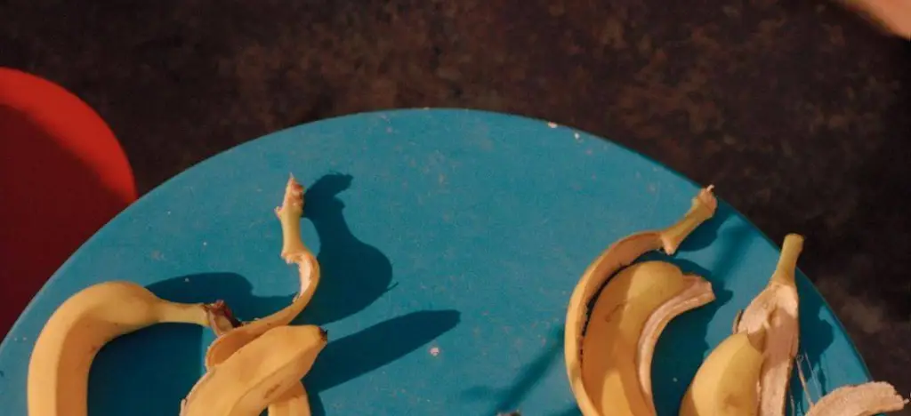

下午  

时间是从下午四点开始的，我从沙发上醒来，已经是四点，一个下午，我什么也没有做。此时正对着我的门是开着的，门的外面，是灰色的水泥楼梯。再晚一点，夕阳就会从走廊中的一个窗户中穿过，正正好好停在门框边，我就要开始看报，邻居们就要纷纷回家。再晚一点，天就会彻底黑下来，会传来厨房里烧饭的声音，荧光灯把我的脸照的惨白，接着一天就会结束。  

有一些传言说，今天有一些人要来家中拜访，但我并不听信。我只要摸一摸我后脑勺，没有头发，我便是在梦中，有头发，那就是在现实。显然，我能摸到我茂密的头发，它们还和我年轻时的长发一样柔顺。于是我放心地倒上一杯水开始看报，可是报纸上几乎都是照片，只有一行文字说，“你要听照片的话，这个世界上哪有什么真理，只有照片。你的爸爸妈妈都是拍照片的人，这意味着他们生来就不能说谎。”  

我将信将疑地看完了报纸，那几乎不像是一份报纸，反而像一本日记，那些照片里都是一个个正在说话的人，就像在重述我上大学毕业时，脑中填满的格言和警句，我止不住的眼泪就留下来。我折好报纸，回到沙发上，这时的夕阳正好从走廊的一扇窗户中穿过，映在门上，那些斑驳的影子就乘机进到我的屋子里。它们变成一个个人的形状，企图搬走我停在厨房的自行车，我跑过去用力地阻止它们，并且质问它们为什么要偷走我的东西，它们不回答。就这样我们争执了四五十分钟，直到夕阳再也无法从那扇窗户中穿过，它们才消失。我的邻居们纷纷回家了，晚上，我在厨房开着荧光灯烧饭，荧光灯把我的脸照的惨白，我几乎看不出我的影子是什么形状。  

一连几个下午，我都在与这些影子争夺。我决定把这件奇怪的事告诉我的朋友，他们都瞪大眼睛觉得不可思议，甚至为这样几乎不可能发生在这个世界上的事情而感到兴奋。但我已经很是疲惫，还好，我还有几天，就要搬离这里了，新的公寓就在不远处，是一个三角形的木屋，我决定提前几天先把一些多余的物品搬去新家。那天，我收拾好箱子，高高兴兴地出门，木屋前已经有许多等待的人群。终于轮到我，可是我发现我的身体怎么也进不了那间木屋，总是卡在入口的一个转角处，我的身后还排着长队，我感到万分焦急。已是落日时分，我看到一扇相同的窗户在我的前方，相同的夕阳穿过它，照在我的身上。这时我身后的队伍开始有些骚动了，他们推开我，像影子一般，将自己的身体贴着墙壁向上爬，折过这个小小的转角，一个挨着一个上楼。我惊呆了，我丢下箱子跑回家，来到走廊，那些影子还在拉扯我的自行车。我用一张报纸挡住那扇窗户，它们才作罢，离开，报纸透着阳光，看不住一点它会使坏的样子。  

我有时会想我是不是进入了某个我设想过的世界，每当这个念头升起，我就会摸摸我的后脑勺，我的头发依旧是如此茂密，这使我确信，这不是这些怪事发生的原因。我依旧会从沙发上醒来，看报，夕阳穿过窗户，邻居们回家，传来厨房里烧饭的声音，荧光灯把我的脸照的惨白，如此，我已经生活了八十年，时间是从下午四点开始的，我几乎不会怀疑这件事。  

2022.10

Afternoon

Time started at four o’clock in the afternoon. I woke up from the couch and it was four o’clock, an afternoon which I did nothing. The door facing me was open at the moment, and beyond it, the gray concrete stairs. A little later, light of the setting sun would pass through one of the windows in the hallway and rest squarely against the door, and I would start reading the newspaper, and the neighbors would go home. Then it would be completely dark, there would be sound of cooking in the kitchen, the fluorescent lights would shine my face horribly white, and then the day would be over.

There were some rumors that some people were coming to visit me at home, but I did’t believe it to be true. All I need to do is to touch the back of my head. If there is no hair, I am in a dream; if there is hair, I am in reality. Apparently, I can feel my lush hair, and they are still as soft as the long hair I had when I was young. So I was relieved to pour a glass of water and start reading the newspaper, but the newspaper was almost all photos, with only one line of text saying, “You have to trust the photos, where is the truth in this world, only photos. Your mom and dad are both photographers, which means they are born unable to lie.”

I read the paper with disbelief, it hardly looked like a newspaper, but rather like a diary, the photos were of people who were talking, like a retelling of the mottoes and aphorisms that filled my head when I graduated from college, and I couldn’t stop the tears from staying. I folded the newspaper and went back to the couch, when light of the setting sun passed through a window in the hallway and reached on the door, and the dappled shadows took the opportunity to enter my house. They became the shape of individuals and attempted to move my bicycle that was parked in the kitchen. I ran over to them and tried hard to stop them and questioned why they were trying to steal my bicycle, but they never answer. We scrambled for 40 or 50 minutes until the light could no longer pass through that window and they disappeared. Then my neighbors went home, and at night I cooked in the kitchen with the fluorescent lights on, which lit up my face so white. I looked down to my feet but I could barely make out the shape of my shadow.

For several afternoons in a row, I scrambled with these shadows. I decided to tell my friends about this strange occurrences, and they all stared in disbelief, even excited by such an almost impossible thing to happen in this world. But I was already very tired, fortunately, it was only a few days to go before I moved out of the place. The new apartment was not far away, a triangular shaped wooden house, and I decided to move some extra items to the new home a few days early first. That day, I packed my suitcase and went out happily, there were already many people waiting in front of the cabin. Finally it was my turn, but I found my body is too big to enter the house. I was stuck in a corner of the entrance, and there was a long line of people behind me, which made me felt very anxious. It was sunset at that moment when I saw an identical window in front of me, and the same light passed through it. The people in the line behind me started to stir a little. They pushed me aside, like shadows, kept their bodies close to the wall, folded around this tiny corner and went up the stairs one by one. Stunned, I dropped my suitcase and ran home. The shadows were still pulling at my bike in the hallway. I blocked that window with a piece of newspaper before they gave up and left. The newspaper soaked through the sunlight that I couldn’t see anything bad it would do.

I sometimes wonder if I’ve entered some world I’ve envisioned, and whenever that thought struct me, I touch the back of my head, where my hair is still so thick that it assures me that it’s not the cause of these strange occurrences. I will still wake up from the couch and read the newspaper, the light of the setting sun passing through the window, the neighbors going home, the sound of cooking in the kitchen, the fluorescent lights shining my face horribly white, which I have been living with for eighty years. Time starts at four o’clock in the afternoon, I would hardly doubt this fact.

Oct 2022
