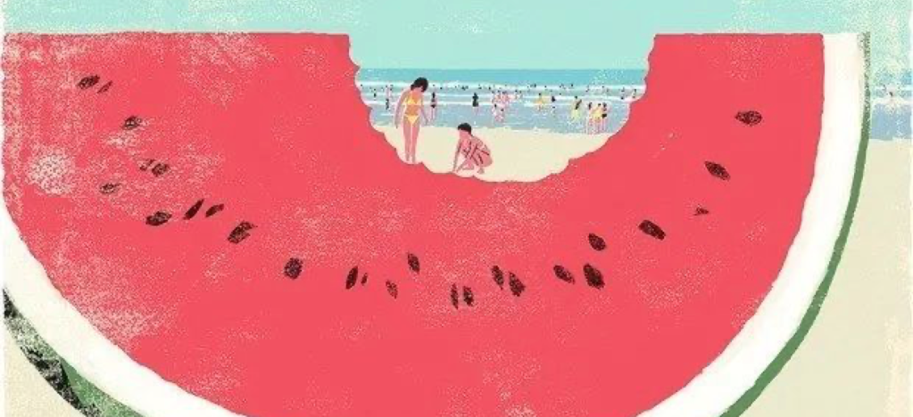

仪式

今天早晨，我第一次意识到了频率。那时天刚亮，我听见一架飞机由远及近从我的屋顶略过，那低沉的嗓音环绕着我，房间宛如重金属音乐会现场。接着是楼下的保洁拖着带滚轮的集体垃圾桶，走过楼下的小道，由近及远。天亮了，我想我的家是一辆幸福的卡车，我就是在深夜为超市送货的卡车司机。这爱抖腿的小发动机，我没有一次嫌弃过它。

加满汽油的时候，我意识到我是一个与空调频率同步的人。打开收音机，这聒噪的人声我并不爱，他们的频率像忽快忽慢的水龙头，使我总是踏错节拍。我不等了，在高速里继续开，季节还是雨天，我驶过了两个淡水湖和一座水库，让货物都染上了的虾和蟹频率。我起伏不定的座椅，像一只金鱼的腮，而我从未意识到它在呼吸。我的晚餐是在一座服务区的餐馆，那时电视机正在播放水果新闻，芒果，樱桃，番茄，西瓜……

我见过的西瓜都是千篇一律地催熟的，过去的西瓜从未拥有过现在如此饱满的频率。走在高速上，混入奔驰的车流，我感到我是多么无助，加油站像一片沙漠，布满了铁树，棕榈树，多肉植物…….走到招待所时我已口渴难耐，忽然我感到我的邻居有一种人工智能西瓜的频率，那是一种很聪明的，里面长着脑子的稀有西瓜。显而易见，这种西瓜在学会了使人上瘾后，已经威胁到了人类这个物种，我们决不能纵容这种西瓜自由地生存下去。于是我模仿一个走路同手同脚的人，到她面前，告诉她我爱她。

2020.7

Ceremony

This morning, for the first time, I became aware of the frequency of everything. It was just after dawn when I heard an airplane skimming over my roof from far to near, the low voice surrounding me, inside the room like a live heavy metal concert. Then the downstairs janitor dragged the collective garbage cans with rollers down the pathway, from near to far. It was dawn, and I thought my home was a happy truck, and I was the truck driver making late-night deliveries to the supermarket. This little engine that loves to shake its legs, not once have I wouldn’t say I liked it.

As I filled up with gasoline, I realized I was the one who was in sync with the air conditioning frequency. Turning on the radio, the raucous vocals I didn’t love, their frequency like a fast and slow faucet, made me always step on the wrong beat. I didn’t wait. I kept driving on the highway, the season was still rainy, and I went through two freshwater lakes and a reservoir so that the cargo was dyed shrimp and crab frequency. My undulating seat resembled the gills of a goldfish, and I never realized it was breathing. My dinner was at a restaurant in a service area, when the TV was playing fruit news, mangoes, cherries, tomatoes, watermelons …….

I’ve seen watermelons ripened in a thousand different ways, and they never used to have the frequency of fullness that they do now. I felt how helpless I was walking on the highway, blending into the Mercedes traffic. The gas station was like a desert, covered with ironwood trees, palm trees, succulents ……. Walking to the guest house, I was thirsty. Suddenly, I felt the frequency of an artificial intelligence watermelon in my neighborhood, a very smart watermelon with a brain inside. Obviously, having learned to make people addicted, this watermelon has threatened the human species, and we must not allow this watermelon to live freely. So I imitated a man who walked homolaterally, went to her and told her I loved her.

July 2020
