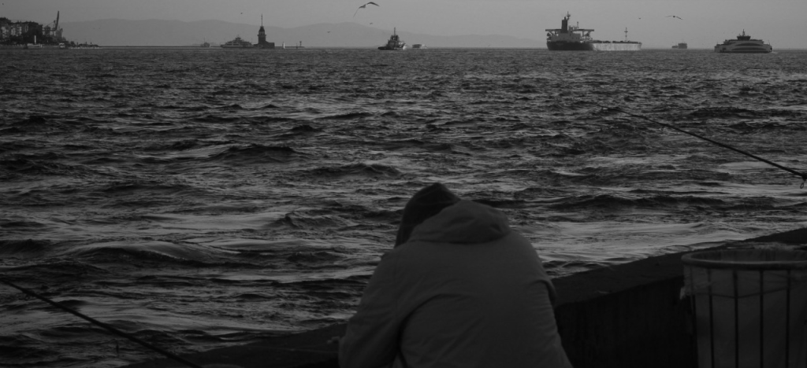

节日  

杀一条鱼，需要详细缜密的构思。首先要捧起鱼举过头顶，对着神像心怀感激，这馈赠的美味。随后重重地摔下，若是挣扎，那么用重物捶向鱼的头部，将它击晕，这是麻醉。为它去鳞，握住鱼头，在水流中用刀背小心地刮蹭它的身体，用塑料袋接住四溅的鳞片。这时的鱼可能会蜷曲身体，不用担心，这是它无知觉的反应，它并感觉不到疼痛。接下来，将它放到砧板上，用食指握住鱼嘴，拇指扒开鱼鳃，另一只手握住刀，切走它暗红色的鳃。等两边都切完，狠下心用力切下鱼头，它便不再会挣扎。然后则是切开肚皮，掏出内脏，沿着脊柱切下鱼肉，稍加料酒腌制，放入葱姜蒜蒸煮，就可成为一道佳肴。我戴着帽子，日日夜夜地思考，整齐的羊群。直到我能够想象出每一个环节的图景，直到我能握着刀对着空无一物的砧板闭着眼重复这些动作，直到我能在梦中触摸到那条鱼，和我挣扎的同情心，我才觉得我有十足的把握。走在街上，我感到我的决心像那些看不清的海报，而我终将抵达它们的脚下。杀一条鱼，今天我从海鲜市场买回它，对着神像。第一幕就出乎了我的意料：它猛烈地挣扎，滑出了我的双手，与神像一起摔在地面上，神像的碎片刮伤了它，留下浅浅的血迹。我急忙捧起它，剩下的步骤倒是还算顺利，没有更多的意外。我将它放入一个长角的盘子里，不算太糟，这料想中的一切马上将品尝到。但是我没有料到我偶有的对神的不敬，和有意或无意中颤抖的双手。碎片和血迹依旧在那里，今天是一个节日。

2023.5

Festival

Killing a fish requires detailed and meticulous conception. First of all, lift the fish above the head, and be grateful to the statue of god for this gift of delicacy. Then drop it heavily. If it struggles, knock it until be unconscious by whacking it on the head with a heavy object, which is anesthesia. To remove its scale, hold the fish by the head and carefully scrape its body with the back of a knife in the current, using a plastic bag to catch the splattered scales. The fish may curl up at this point. Don’t worry, this is its insensitive response and it doesn’t feel pain. Next, place the fish on a cutting board, hold the mouth with your index finger, peel back the gills with your thumb, and hold the knife in your other hand and cut away the dark red gills. When both sides are cut, cut off the head hard, and it will no longer struggle. Then cut open the belly, pull out the guts, cut the fish along the spine, marinate it with cooking wine, add onion, ginger and garlic and steam it, then it becomes a delicacy. I wore my hat and thought day and night about the neat flock of sheep. Until I could visualize each part of the picture, until I could hold a knife to an empty cutting board and repeat the actions with my eyes closed, until I could touch the fish in my dreams, and my struggling compassion, I felt I had full control. Walking down the street, I felt my resolve like the unreadable posters whose feet I would eventually reach. Killing a fish, I brought it back from the seafood market today. Facing the statue of god. What was unexpected is the very first act: the fish struggled violently, slipped out of my hands, and fell to the ground with the statue. The splinters scratched it and left a shallow bloodstain. I hastily picked it up, and the rest of the steps went fairly smoothly, without further mishaps. I put it into a long-horned dish. Not too bad, which expected to taste everything immediately. But I didn’t anticipate my occasional disrespect to god and my intentionally or unintentionally trembling hands. The splinters and the blood were still there, and it was a festival.

May 2023
