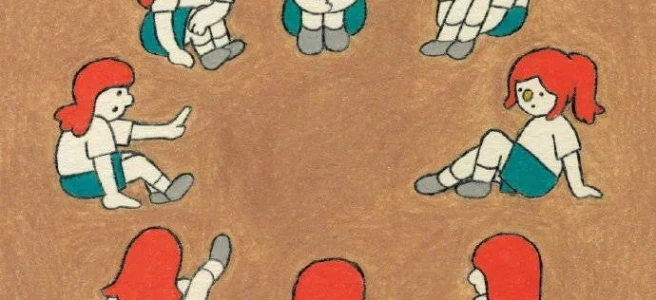

游戏

在那间不够宽敞的棋牌室里，我与我的朋友们发明了众多打牌的方法：比如某一局，我们强行规定6张3是全场最大的牌，比炸弹[1]都要大；比如又有一局，我们规定全程不能出对子[2]。这些打法往往是发完牌某个人一时兴起规定的，指着天花板那只扑腾的电风扇发毒誓。照理说游戏规则不应该由游戏的参与者制定，但是我们玩得太久，早已不在乎输赢。虽然有许多次，我知道我是能赢的，但“赢”对于我们来说，已经一种过时的趣味。我和我的朋友们，沉迷于开场就下炸弹的陋习[3]，或是配合一通无关紧要的演讲之后，忽然决定明牌，然后当着大家的面将飞机拆成一张张单张[4]。有几次，我们还在某些局里加入了抢牌规则，只要讲出任何一条理由就可以要求对方交出某张牌（如果有的话），于是那一局就成了无厘头诈骗犯们的表演时间。

我们拙劣的表演吸引了越来越多的人加入，或是围观。在短短几周之内，这间小屋子里的玩家数量就从七八人翻了个倍；桌上的牌也越来越多，已经不止是几副而是几十副，后来我们也弄不清有没有漏牌，干脆抓起一把就开始打，多少任意。我们的规则越来越复杂：比如有一次我们用打牌的方式下五子棋，用牌面数字代表落子的坐标。后来我们发现这样的规则还能继续迭代：用打牌的数字代表坐标解数独，用数独中想要填的数字代替骰子下飞行棋。我们的规则还带入了破坏性：有一次我们规定墙上那只时钟上的日期的末位数字是那一局每个人每次必须出牌的数量，自从有了一个人自说自话地将钟拨到下一天于是多出了一张牌之后，每个人都在出牌前都去拨弄那只时钟，我们结束时时间已经过了一整年。

渐渐地，那个小屋子已经容纳不下我们，于是我们搬到了厅里；厅里也容纳不了我们，我们就搬到了街上；围观的人群已经是里三层外三层，我们就搬去广场。冬天，广场上的风很大，我们用轮胎堆了一个迷宫，一开始还是平面的，后来就变成立体的，再后来是路径会是随时更换的：墙会随时倒下变成路，路会忽然通向另一个方向，走过的路上会忽然冒出墙。我，和我的朋友们，在一个运动的平台上打牌，尽量让每个迷宫里的人，看到其中的一局。但我们从不记录这些突发奇想的规则，我们放任自流地让这些规则自生自灭，如果，如果有任何一种规则幸存下来的话，我们就不得不开始背负它。它会像债务般沉重地挂在我们的脖子上，除非我们能够意识到，在创造规则的游戏里，我们的发明很快就将变成束缚我们的绳索。

我和我的朋友们无法无天的行为终于惊动了上帝，于是这一天，他来到我们的牌局上，指名道姓地要求我与他单挑。我好久没遇到这么简单的牌局了，但唯一的问题是桌上的牌已经太多。上帝说没关系，我们可以一边摸一边打，我说好。于是我们就这样昼夜不分地打牌，我的拇指上开始因为丢牌而长出老茧，我的头发也因为思考或是焦急开始发白，我的朋友们，我也不知道他们来来回回地换了几波，就快要打完了，就在这时，我才意识到这是一个陷阱：这是两个人的牌局，我能知道他手上的牌他也能知道我的牌。我向他摊牌说我不干了，我生气地揪住他的耳朵，才认出来：我亲爱的，假装上帝的朋友，露出了脖子上的胎记。

[1] 炸弹: 四张以上同样大小的牌被称为“炸弹”。在扑克牌规则中炸弹比任何单张、对子、大小王更大，通常用于终结一局游戏或者抢夺出牌权  
[2] 对子: 两张同样大小的牌被称为“对子”  
[3] 开局就下炸弹: 在扑克牌游戏中这是一种非常愚蠢的出牌方式，通常会导致毁掉出完手牌的可能性并且输掉游戏  
[4] 将飞机拆成一张张单张: 另一种愚蠢的出牌方式  

2020.12

Game

In that less-than-spacious chess room, my friends and I invented numerous ways to play cards: for example, in one game, we imposed a rule that six “3”s were the most significant cards in the room, bigger than even bombs[1].In another game, we stipulated that no pairs[2] could be played the entire time. After the cards are dealt with, these rules are often prescribed on a whim by someone, pointing to the fluttering electric fan on the ceiling and swearing. It is reasonable to say that the game participants should not set the rules, but we have been playing for so long that we don’t care about winning or losing. Although there were many times when I knew I could win, “winning” was an out-of-date form of fun for us. My friends and I indulged in the habit of starting a game with a bomb[3] or with a speech that didn’t matter, and then suddenly decided to show our cards and break the consecutive pairs into single cards in front of everyone[4]. On a few occasions, we also added card-grabbing rules to certain games, where we could ask the other player to hand over a specific card (if there was one) by giving any of the reasons, so that game became a show time for the nonsensical scammers.

Our botched show attracted more and more people to join in or spectate. Within a few weeks, the number of players in this small room doubled from seven or eight, there were more and more cards on the table, not just a few decks but dozens, and then we couldn’t figure out if there were any missing cards, so we grabbed a hand and started playing, more or less at will. Our rules became more and more complicated: for example, once, we played gobang with the poker cards, using the numbers on the face of the cards to represent the coordinates of the falling pieces. Later we found that such rules could continue to iterate: solving sudoku with the numbers of the playing cards describing the coordinates and playing airplane chess with the numbers you want to fill in the sudoku instead of the dice. Our rules were also destructive: at one point, we specified that the last digit of the date on the clock on the wall was the number of cards each person had to put in the current round of the game, and since a participant acts on his initiative turning the clock to the next day so that he can take his round, everyone went to turn the clock before playing, and we ended up with a full year gone by.

Gradually, that small room could no longer accommodate us, so we moved to the hall. The hall was bursting at the seams. We moved to the street. The street was teeming with onlookers. We moved to the square. The weather was very windy in winter, and we piled up a maze with tires. At first, it was still flat, then it became stereoscopic, and then it was the path would be a ready replacement: the wall would fall into a road at any time, the road would suddenly lead to another direction, and the wall would suddenly appear on the road we walked. My friends and I played cards on a platform in motion, trying to get everyone in the maze to see one of the games. But we never kept track of these sudden rules, and we let these rules loose to fend for themselves, and if, if any of them survived, we would have to start carrying them. It would hang around our necks like a debt unless we could realize that our inventions would soon become ropes that would bind us in the game of creating rules.

The ridiculous games played by my friends and I finally alerted God, so he came to our poker game one day and asked me by name to play him one-on-one. I hadn’t had such an easy game of cards in a long time, but the only problem was that there were already too many cards on the table. God said it was okay, we could play while we drew, and I said okay. So we played around the clock, my thumbs starting to get calluses from losing cards, my hair starting to turn white from thinking or anxiety, and my friends, I don’t know how many waves they changed back and forth, were about to finish, and that’s when I realized it was a trap: it was a two-player game, I could know his hand, and he could know mine. I showed him my cards and said I quit. I grabbed him by the ear in anger, and I recognized it: my dear friend who pretended to be the God, showing the birthmark on his neck.

[1] bombs: more than four cards with the same number can be regarded as “bombs” it’s more significant than any single card or pair, and joker in the poker card game’s rule  
[2] pairs: 2 cards with the same number can be regarded as “pair”  
[3] start a game with a bomb: the dumbest way to play in a traditional poker game, very likely to ruin the card you have on your hand and lead to losing the game.  
[4] break the consecutive pairs into single cards: another dumb way to play in a traditional poker game.  

Dec 2020
