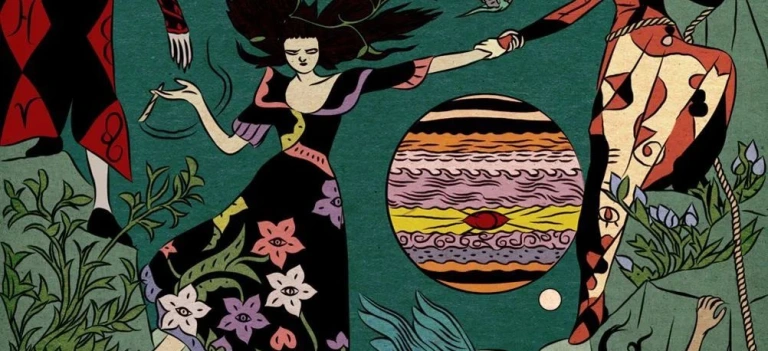

历史

从前，我统治着一个没有人民的王国。这个安静的王国颇让我满意：它强大而有效率的官僚组织会自动安排好这个王国的一切。每一天，我的号令都会被张贴在王国里醒目的位置上，天空中的背景音乐根据我的喜好来回更换十几遍，电视节目可以随意插播我的演讲，我可以清楚地知晓王国的每一个角落。

而我从不想象这里有任何的建筑物，天气或是风景。或者说，它是不定形的，可能我一转身，我就身处一座城市狭窄的巷道里，一座教堂投下的阴影令我无路可退；而下一秒，我就身处沙堡灯火通明的地下广场中央，被为数众多的歧路围困。我有时候在想这是幸运还是不幸：这个王国已经失去了一切作为国家的元素：权力的让渡，契约精神，对暴力的独占……

我有时为它感到自豪。某一天，我宣布将一个双曲线图案定为王国的标志，把这个的标志试图留在所有我路过的地方，墙上，书包上，我的笔记本上。我的朋友发现了我的秘密，向我讨教起运行一个王国的要领。于是纷纷宣布也成立他们自己的王国，我很高兴但是我的国家并没有边界，我只能想象它与那些遥远国家的外交关系。

现在我不知道我应该如何描述它，有时候它混乱得像风暴之海，有时候它温暖得像春夏之交的季风。有时我是悲怆的，那这个王国也跟着我悲怆，有时我自豪，它也会跟着我自豪，有时我想杀死我自己，它也就跟着向死亡的悬崖靠近。我逐渐意识到它并没有自己的独立意识，它像肿瘤一样依附在我的思想上，于是我解散了它。一个没有人认领的王国。

这个王国里仅有的职业是史官，他们勤恳、近乎神经质地记录这个王国的一举一动，仿佛每一天都能写成一本古代史。最困难的事情在查阅历史上，多如牛毛的历史在任何时候都阻止了我查阅它的念头，很快这个王国将不记得它的过去。想到一群史官就能让一个王国不堪重负，变得健忘，早早地开始衰老，就知道它未来的命运，也将一定是像我僭位时那样死气沉沉。

2020.6

History

Once upon a time, I ruled a kingdom without people. I’m pretty satisfied with this quiet kingdom: its robust and efficient bureaucratic organization would automatically arrange everything in the kingdom. Every day, my orders were posted in a prominent place in the kingdom, the background music in the sky changed a dozen times according to my preference, TV programs could insert my speeches at will, and I could know every corner of the kingdom.

And I never imagined that there were any buildings, weather, or scenery here. Or rather, it’s indefinite. I could turn around, and I was in the narrow alleyways of a city, with a church casting a shadow that leaves me with no way out. The next minute, I was in the middle of the lit-up underground square of the Sandcastle, surrounded by numerous divergent paths. I sometimes wonder if this is fortunate or unfortunate: the kingdom has lost all the elements of statehood: the cession of power, the spirit of the contract, the monopoly on violence ……

I am sometimes proud of it. One day I declared a hyperbola as the kingdom symbol, trying to leave this symbol on all the places I passed, on the walls, on my schoolbag, on my notebooks. My friends found out my secret and asked me for advice on the essentials of running a kingdom. So they all announced that they would also set up their kingdoms, and I was happy, but my country had no borders, and I could only imagine its diplomatic relations with those distant countries.

Now I don’t know how I should describe it. Sometimes, it is chaotic, like a sea of storms. Sometimes, it is warm like a monsoon in the spring and summer. Sometimes I am pathos, and the kingdom follows me in pathos. Sometimes I am proud, and it follows me in pride; sometimes, I want to kill myself, and it follows me closer to the precipice of death. I gradually realized that it did not have an independent consciousness, it was attached to my mind like a tumor, so I dissolved it. A kingdom with no one to claim it.

The only occupation in this kingdom was the historians, who diligently, almost neurotically, recorded every move of this kingdom, as if every day could be written as ancient history. The most challenging thing in searching for events in history, as much as there is at any time, prevented me from consulting it, and soon the kingdom will not remember its past. The thought that a group of historians could overwhelm an empire, become forgetful, and begin to age early, tells me that its future fate will undoubtedly be as deadly as when I usurped the throne.

June 2020
