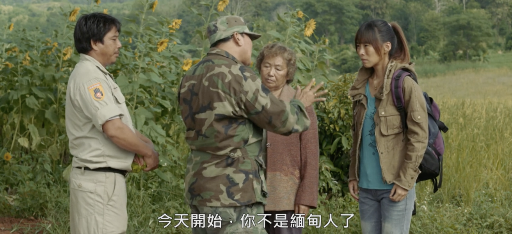

皎漂

我醒来的时候是清晨，几个老人和卖水果的商贩坐在街口闲聊，一开始的声音还算平和，后来越来越来越嘈杂，像是在争吵什么。他们的话我一句都听不懂，也没有一点好奇心，我想他们对我也是如此，即使我坐在窗口笑盈盈地看着他们，他们也不会发现。于是我闭上眼，眼前还是刚才的画面：狭窄的小巷，背景是干净，象牙色的墙，墙面充满想象力地涂着波浪般的石灰泥，一棵樟树绿得火辣，天空蓝得仿佛是错觉。在这里多待一会儿又何妨呢，渐渐地我平静下来，像是回到我童年时的住所。这个梦再多做一会儿又何妨呢，我跑去告诉我的玩伴：“今天我看见一朵不会动的云”。他们都高兴坏了，叽叽喳喳地要把这个消息传递出去，像是要全城的人都知道——那怎么可能，我们这些顽童的世界又怎么会大过这几条巷子、几条街，再往外多走一点就要迷路。老人们吓坏了，他们将我们拦下，说这样的穿着出去不合时宜，问我们需不需要岗包，需不需要帕索，或是笼基[1]。我茫然，任他们将我打扮成一个缅人。倏忽间，我就成为了一个规规矩矩的大人，这一切都没有征得我的同意就发生了，连后悔的机会也没有。一怒之下我逮住其中一个为我剃发的老头，他紧张地说：“为你行礼是我的荣幸，而我就要化为尘埃了”。我再转身一看，这条瘦小的巷子已空无一人，连我的玩伴也消失了，最后一个我能抓住的身影是一条老狗——它一瘸一拐，摇摇晃晃，好像下一秒就要摔倒，我又怎么能想象曾经用了一下午才摆脱它的追赶。而我没有注意到，有许多与我毫无杯葛的人，趁我不留神来到我的身边：他们长的相似，规规矩矩，紧实的工作服覆盖全身，绝不多袒露一根毫毛。这让我不再确信我身处的位置，紧接着是轮船、码头、飞机，和战乱的消息。很快，军人来到，他们禁止售卖水果，说因为全都和色情沾得上关系。进佛寺前搜身的时候，一个士兵无意间将枪口顶住我的背，我感觉我的身体一下变得柔软，任人摆布，就如我的生活，和所剩无几的关系。“接住我，皎漂[2]”，我想，“现在我所有支离破碎的爱都只能给你了。而你于我，又怎么可能变成像他们口中，一个被厌弃的地名。”

[1] 岗包，帕索，笼基：缅族传统服饰  
[2] 皎漂：缅甸若开邦港口城市，2015年来命运一直被中缅原油管道、皎漂深水港、罗兴亚难民危机和缅甸内战所左右。  

2024.8

Kyaukpyu

I woke up in the early morning. A few elderly people and fruit hawker were chatting at the street corner. Their voices were initially calm but gradually became noisier, sounded like they were arguing about something. I couldn’t understand a word they were saying, nor did I have any curiosity about it. I suppose they felt the same way about me; even if I sat by the window smiling at them, they wouldn’t notice. So I closed my eyes, and the scene from before remained: a narrow alley with clean, ivory-colored walls in the background, imaginatively coated with wave-like plaster. A camphor tree stood vibrantly green, and the sky was so blue it seemed unreal. What harm was there in staying here a little longer? Gradually, I calmed down, as if returning to my childhood home. What harm was there in prolonging this dream? I ran to tell my playmates, “Today I saw a cloud that doesn’t move.” They were all extremely happy, chattering excitedly to spread the news, as if they wanted the whole city to know——but how could that be possible? Our world as mischievous children couldn’t extend beyond these few alleys and streets; venturing any further would get lost. The elders were frightened. They stopped us, saying our attire was inappropriate for going out. They asked if we needed a longyi, a paso, or a htamein[1]. I was bewildered, allowing them to dress me up as a Burmese. In an instant, I became a proper adult, neither with my consent nor a chance for regret. In a fit of anger, I grabbed one of the old men who had shaved my head. He nervously said, “It’s my honor to serve you in liturgy, and now I shall turn to dust.” When I turned around again, the narrow alley was empty, even my playmates had vanished. The last figure I could grasp was an old dog—limping and tottering, as if it might fall at any moment. How could I imagine that I once spent an entire afternoon trying to escape its chase? I hadn’t noticed that many people with whom I had no connection had been around me: they looked similar, proper, with tight work clothes covering their entire bodies, not exposing a single hair. This made me unsure of where were I. Followed by ships, docks, planes, and news of war. Soon, soldiers arrived and banned the sale of fruit, claiming it was all related to pornography. During a body search before entering a Buddhist temple, a soldier accidentally pressed his gun muzzle against my back. I felt my body suddenly become pliable, at the mercy of others, just like my life and the few remaining relationships I had. “Hold me, Kyaukpyu[2],” I thought, “now all my fragmented love can only be given to you. And how could you possibly become a despised place name in their words?”

[1] Longyi, Paso, Htamein: Burmese traditional dressing.  
[2] Kyaukpyu: A port city in Rakhine State, Myanmar, whose fate since 2015 has been continually shaped by the China-Myanmar oil pipeline, Kyaukpyu deep-sea port, Rohingya refugee crisis, and Myanmar’s civil war.

Aug 2024
