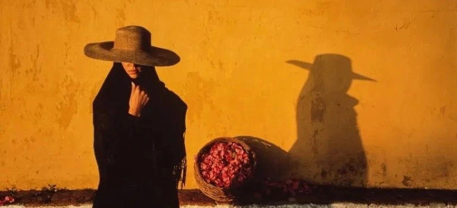

囚徒

我终于在日落时分赶到了崇祯[1]自缢的那棵老歪脖子树下，已接近公园的闭园时间，几个中年人三三两两地走下台阶，再往上，就看不到任何一个人。我来到这儿，不是为了树，也不是为了崇祯，只是想知道为什么。树不会说话，空长出形状极不协调的枝干，不开花也不结果，像是说：“他死了，但是我还活着，他死的越久，我越是骄傲”。

那时我正处于命运最动荡的几天，今夜我就要离开北京，保研结果也很快就将知道。我望着老歪脖子树并不茂密的树冠，配合北京的夏季傍晚的闷热，有一种生死由命的眩晕。我想起我上学前与某个长辈，在家中下围棋[2]。他说，我是晚辈，用黑棋，他是长辈，用白棋，恰如我俩的发色。我下的并不好，总是被吃子，被逼到无处可退的角落。他应该不知道，我在下棋时想常常看着被吃的棋子堆成的棋堆，想，我为什么要同意和他下棋，而老了究竟是一种怎样的感觉。

也就是在这时，我注意到了原来这里还有人。一个算命先生，穿着深色的长袍，坐在一块假山石上。我注意到了他手里竹制的求签桶，但他不像明码标价的骗子，他没有地摊也没有板凳。他看起来风烛残年，眼袋很重，但眼神里像是料到我会到来，已早早地等待我许久。我正想开口，这时他对我说：“小伙子，来算个命吧，十分钟不吃亏。”

我没有听他的话，连忙表示拒绝：“算了算了，我的时间不多了，载我的火车在等我，错过就是一辈子。”说完我又觉得有些矛盾，时间不多，但十分钟用于算命还是有的。错过火车是一辈子，错过停靠的任何一个站台也会是一辈子。我相信很多地方我只会来一次，老歪脖子树说不定也是。于是我羞愧地低下头，只听见他又说：“来算个命吧，年轻人，你还有的是时间，来犹豫和后悔。”

我抬起头，条件反射式地拒绝了他，连眼神都是像预先排练好那样坚定。我一向不信算命先生，不相信他们有任何预知未来的能力。像教科书里所说的那样，相信算命只是个样本量和概率的问题，成功难以复制。我转身就背着他离开了，连崇祯和歪脖子树的问题也没解决，这注定是一次遗憾的到访。可我为什么又分明感到，这是我最虚弱的一刻，我的朋友在公园外等我，要请我吃饭。是吗，我说对了吗？算命先生，这是不是你所希望的，让我这样不相信命运的人也开始相信，我可能确实错过了一个收买什么的机会。而我这样的拒绝，也太干脆、太无情了一些。

[1] 崇祯: 暴君, 明朝 (1368-1644) 末代皇帝  
[2] 围棋: 一种双人策略游戏，目标是围住比对手更多的地盘。围棋在中国发明，有大约2500年的历史，2017年谷歌的AlphaGo打败了当时世界排名第一的围棋选手柯洁

2020.6

Prisoner

I finally arrived at sunset under the old crooked-necked tree where Chongzhen[1] hanged himself; close to the park’s closing time, a few middle-aged people walked down the steps in twos and threes, and further up, there was no one in sight. I came here, not for the tree or Chongzhen, just to know why. The tree doesn’t speak and grows empty with incongruously shaped branches that don’t bloom or bear fruit, saying, “He’s dead, but I’m still alive, and the longer he dies, the prouder I am.

At that time, I was in the most turbulent days of my destiny, and tonight, I was leaving Beijing, and the result of the application to my dream university would soon be released. I looked at the not-so-dense canopy of the old crooked-neck tree, and with the sweltering summer evening heat of Beijing, I felt a dizzying sense of life and death. I remembered playing Go[2]  at home with some elders before I went to school. He said that I was junior and used black, and he was an elder and used white, just like our hair color. I didn’t play well, constantly losing my territory and cornered with nowhere to retreat. He should not have known that I wanted to often look at the pile of removed pieces while playing chess and think about why I agreed to play chess with him and what it was like to be old.

At this point, I noticed that there was someone else there. A fortune teller, wearing a dark robe, sat on a rocky hill. I saw the bamboo bucket in his hand, but he didn’t look like a con man with a price tag. He didn’t have a stall or a bench. He looked old and had heavy bags under his eyes, but his eyes looked like he expected me to come and had been waiting for me for a long time. I was about to speak when he said: “Young man, come to me, and I’ll tell you your fortune, ten minutes without loss.”

I didn’t listen to him and hastily said: “No, I don’t have much time left, the train carrying me is waiting for me. If I miss the train, I’ll not be able to retake it in my lifetime.” After saying that, I felt some contradictions. Although I don’t have much time, ten minutes for fortune telling is still there. If I miss the train, I’ll not be able to retake it in my lifetime. But missing any stops, I will also not to able to visit them in my lifetime. I’m sure there are many places I’ll only visit once, and the old crooked-neck tree might as well be. So I bowed my head in shame, only to hear him say again, “Come, and I will tell you your fortune, young man. You still have plenty of time to hesitate and regret.”

I raised my head and reflexively rejected him. Even my eyes were as firm as if they were pre-rehearsed. I have never believed in fortune tellers, in their ability to foretell the future. Like the textbook says, believing in fortune-telling is only a matter of sample size and probability, and success is difficult to replicate. I turned around and left with him on my back, not even have an answer to the problem of Chongzhen and the crooked neck tree, which was destined to be a regrettable visit. But why do I feel again that this is my weakest moment? My friend is waiting for me outside the park to invite me to dinner. Am I right? Fortune-teller, is this what you want, for someone like me, who doesn’t believe in fate, to start thinking that I might indeed have missed an opportunity to know something. And that was a bit too dry and ruthless of rejection on my part.

[1] Chongzhen: Tyrant, last emperor of the Ming Dynasty (1368-1644)  
[2] Go: Its another name is Weiqi, an abstract strategy board game for two players in which the aim is to surround more territory than the opponent. Invented in China more than 2,500 years ago. In 2017, Google’s AlphaGo beat Ke Jie, the number one ranked player in the world at the time.  

June 2020
