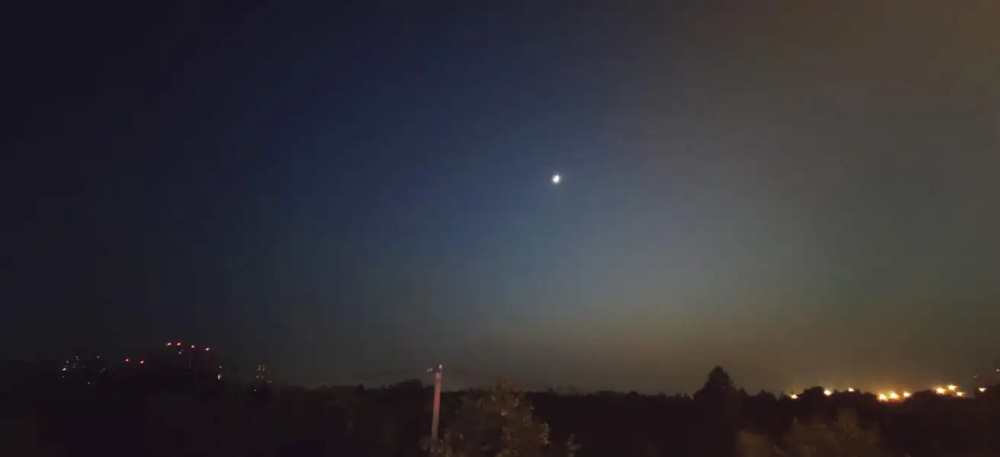

骑行

我和他是在运动会上认识的，赛场上我们是对手，但赛后我们成为了朋友。那时我们都处在各自的困境里：我在集体里并不受欢迎，而他为家庭的纷争所困。只有在困境里的人才会相互理解。那几年，时时刻刻，我都能感受到四周宁静的敌意，常常想快点逃离这个罗素悖论里的世界。他呢，往往将处境怪罪于命运以及自己的愚钝，苦苦地向外界寻找支持。我们常常在夜晚空无一人的运动场上散步，然后就各自回家，虽然我们从来都没有想明白过，在与那些无形之物的搏斗中，我们究竟会成为什么。  

最后一次，我邀请他去一个非常偏远的店里吃火锅，那时我们已经毕业，总算是在朦胧中看到一些转机。他告诉我，他已经没有那么讨厌他的家庭。毕业后，他的父母已经不再要求他更多，仿佛他们各自都承认了自己的缺陷和不完美。曾经想要从自己身上抹去与那些他的父母相似的部分的念头，一个眼神，或者一种说话的语气，他开始慢慢与它们和解。而我告诉他，我会继续小心地保持着我使用语言的能力，我的脑海里有一间暗室，它不需要光，水，泥土和空气，我的所有想象都来自那里。它是一种力量，只有声音能改变它的形状。我在漫长的小心地保卫它的过程中，发现了它在假寐的外表下的孤独：它是许多无名氏的墓。吃完饭，我们一起骑车回家，先是路过了一个十分吵闹的路口，路口都是卡车和水泥搅拌车。我重新仔细地打量他，似乎在样貌上，都和我当初认识的时候没有什么变化，但是显然他已经比过去快乐许多。  

然后我们穿过了一座非常高的铁路跨线桥，在桥上看到两列高铁相向而过，还有摆着音响唱歌的人。过了桥就是灯光全无的小道，什么也看不见，伸手不见五指，只能看到月亮和地平线附近朦胧的红光。接着过了一条马路，我们进入另一条漆黑的路，路边有杂货店，但是灯光全都是微弱的白炽灯发出的。时不时我们的对面会驶来摩托车，刺眼的远光灯使我们睁不开眼睛，也有汽车从身后超过我们，把我们的影子照的很大。我感受到一些从未有过的感觉，有些日子活下来，剩下的，会从日历的车辙上抹去。  

就这样的路，路边偶尔有行人，有钓鱼的人。偶尔有岔路口，通向更黑的地方，更黑的地方是高大的桥吊，是监狱，是生锈的铁门，是磨具公司，是灯具厂，是熄灯的仓库，是全是杂草的荒地。我听见来自远方的声音：它很响亮，来自很高的天空，在我的耳边不断回响。它只在我的睡眠中出现过，仿佛来自一个神秘的巨人，数不清的工人正与它的身体交手。工人的生活，才是我们各自的家庭生活。再接着是一座低矮的桥洞，一座村庄，我们就拐到了大路上，又是立交桥，跨过一条极宽的河，有人在桥上卖一块钱一斤的西瓜，和六块钱十斤的香蕉，然后是吹萨克斯的人。下了桥，就看见通往天的高速。  

我想说的就这么多，临近分别，我把送他的两本书放在他的车篮里，我们今天的十八公里的骑行，就算结束了。他说他今天很感谢我，我看着他真诚的眼神，也不知道那两本书，他会不会翻开。我能做的也就这么多，在此之外的都只有希望。希望我们都有了各自的答案，希望这个夜晚在我们流淌的人生里，被记住，被我们各自的历史诠释，星星点点，有亮光。希望我们记起这个夜晚的时候都隐秘，恬静。直到我们瘦骨嶙峋的时刻，怀揣曾经丰富的欲望，摸到死亡的肩胛骨。  

2023.9

Ride

I met him at a sporting event. We were rivals on the field but we became friends afterward. At that time we were both in our own predicaments: I was ostracized in the school, and he was trapped by family conflicts. Only people in predicaments understand each other. During those years, I could feel the quiet hostility around me all the time, and often wanted to escape from this world of Russell’s Paradox. He, on the other hand, often blamed his situation on fate and his own stupidity, and struggled to look for support from people outside of his family. We used to take walks on empty playground at night and then go home, though we never figured out what we would actually become in the battle against theose invisible things.

The last time when I invited him to a hot pot at a very remote restaurant, we had graduated by then and were finally seeing some turnaround in the haze. He told me that he didn’t hate his family that much anymore. After graduation, his parents had stopped stressing him out, as if they had both acknowledged their own flaws and imperfections. Thoughts that once wanted to erase from himself the parts of him that resembled his parents, a look, or a tone of voice, began to reconcile with him slowly. And I told him that I would continue to keep my ability to use the language. There’s a dark room in my mind that doesn’t need light, water, dirt, or air. All of my imagery comes from there. It’s a force that only sound can change its shape. In my long and alert defense of it, I find its loneliness beneath faux-sleepy exterior: it’s a tomb of many nameless people. After dinner, we rode bike home together. We first passed a noisy cross full of trucks and cement mixers. I looked him over again. It seemed that all was unchanged from when I first met him in appearance, but it was clear that he was much happier than he had been in the past.

Then we crossed a railroad bridge with large height, where we saw two trains passing each other and people singing with stereos. Beyond the bridge was an unlit trail where you could see nothing but the moon and a hazy red glow near the horizon. Then we across a road and entered another dark road with grocery stores. The lights were all from weak incandescent bulbs. Every now and then motorcycles came across our path, blinding us with their high beams, and cars passed us from behind, casting large shadows on us. I felt something I had never felt before, that some days would live on and the rest, would be erased from the ruts of the calendar.

It was just such a road, with occasional pedestrians on a side of it, fishing quietly. Occasional forks in the road that lead to darker places where were bridge cranes, prisons, rusty iron gates, abrasive companies, lamp factories, warehouses with lights out, and wastelands full of weeds. I heard a voice from far away: it was loud, from very high in the sky, and it kept echoing in my ears. It only ever came to me in my sleepness as if from a mysterious giant with whose body uncountable laborers were fighting. Life of laborers is which our parents have. Then there was a aperture of bridge with low cellings. Then a village. Then we turned onto the main road, overpasses again, across an extremely wide river, where hawkers were selling watermelons for one yuan a pound, and bananas for six yuan every ten pounds, and then a saxophone player. When we got off the bridge, we saw the highway to sky.

That was all I wanted to say. I gave him two books in his bike basket before saying goodbye to him. Our eighteen kilometers of bike riding tonight ended up here. He thanked me a lot. I looked at his sincere eyes, and wondered if he would open the books. That’s all I can do. Beyond that, there’s only wish. I wish that we all have our answers now. I wish that tonight will be remembered in our flowing lives, interpreting by our histories respectively, shining like bright stars. I wish that we will get feelings of secrecy and serenity every time we recall the night, until the moment when we are thin and bony, harboring desires that were once abundant, touching the shoulder blades of death.

2023.9
