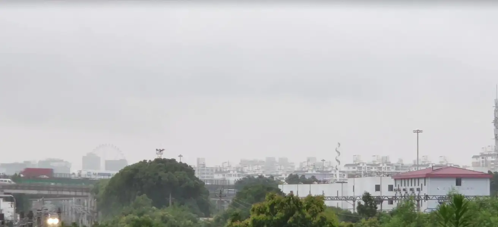

叙事

在莘庄[1]的地铁站旁，我遇到了一个狗尾巴草花园。它原本种着多肉，但无人打理，于是狗尾巴草就占领了这里。莘庄的植物真多，许多植物处于无人修理的状态，就形成了一个野生的植物园。每个周五，我都会和我的朋友来花园散步，闲聊起近况和新鲜事。我常常在去过花园之后就生病了，整个周末在睡梦中度过，但在周一又总会好起来，这不会使我太担心。比起周围的天桥和车站，这个花园大概是我最喜爱的散步地点了。

那时我还在一所音乐学院上学。这所音乐学院还保留着通识教育，每一周，都有一节实验课。有时是在日落时分观测水星，有时是解剖金鱼，有时是在实验室观察燃烧现象。可以说，这节实验课给我平日里枯燥的音乐学习带来了无尽的快乐，像一剂辣，品尝过后要缓许久，一周一次。我的许多想法，就是从实验课上冒出来的：譬如用草茎制作火柴，重新发明眼镜之类的东西。还有就是看到周围这一群音乐家，他们在科学学习上笨拙的样子，时而被吓到时而又疑惑不已，不禁感到好笑。

几乎我所有的好朋友都是在那节课上认识的，如果要说有共同点，那就是我们热爱科学，把音乐当成一门实验科学去研究，企图用排列组合来穷尽音乐的所有可能。实验室里有许多瓶瓶罐罐，各色液体，课程结束之后，我们常常看到科学老师在悄悄地摆弄、观察着什么。我们都觉得，科学老师一定在背着我们做什么秘密研究，说不定他能够帮助我们探索音乐。于是我们把这个想法告诉了实验课老师，老师笑了笑，说：”这种天真的想法，早已在我的实验室的瓶子里湮灭了“。我们只好作罢。但我仍然不死心。

于是，我想办法把这个想法告诉我的音乐老师，虽然我并不报太大的希望。在一个下午的课间，我偶然遇到了音乐老师，向她讲起我这个思绪已久的想法。我努力让我的音乐老师知道一点什么，但是她表示了她的兴趣之后，就没有再下一步。显然，这也有我的责任，我的陈述太简略，我没有时间也没有途径搜索数据，我无法使用谷歌。显然，这个想法的命运是将会被淹没在生活的琐事之中。我的音乐老师转而让我给其他老师送去文件，并提醒我别忘记下课来谈心。我带着文件去到办公室，看见他们在抽烟聊着天，于是把文件放在桌上就溜了出去。“事情没有改变，什么都改变不了”，我心里苦苦地想，即使是我本能地，甚至是似乎被别人控制着地想改变什么。

但我还是赴约了，傍晚，我们走在泥泞的路上，讨论着饲养龙卷风之类诡异的事，小心避开那些奇形怪状的动物。我们走下公交车，路上尽是逆向而来的人，他们谈论着与音乐毫不相关的事情，我跟着我的老师走进她的院子。新冠，给所有马戴上了口罩，我问她，“封城就是罢工，一个月损失了几百亿，但你似乎并不知道？”她说，“我知道，但是我不关心。音乐学院，就是观点学院，每一种音乐都是一种观点。你可能觉得这个事实让你感到偶尔的不适，没事，你不必理解所有。我们通常只通过几个传递快乐的接口互相连接着，音乐是其中一个。在其他时候，我们的情绪并不相通。”接着，我们谈起最近练习的音阶，有的音阶像台阶，有的音阶像纸张，本应该撞得我生疼，但我却没有感觉，这使我惊讶。

所以我来到狗尾巴草花园，来和我的朋友散散心。地铁站旁有一个年久失修的商场，铁锈的痕迹和爬墙虎正在墙上延展，但我仍能听到商场里讨价还价的声音、孩子的喧闹和狗叫声。周围的新店纷纷倒闭，只有这家破旧的商场生意兴隆。“所以，这个想法，它会是一种人形吗？”他问我，我哑口无言，沉默了许久也没有答案。我尴尬地看着他笑，“算了，还是下一个话题吧”。还有太多没来得及兑现的想法，以及向想法兑现的诺言，它们像日落时分的萤火虫，在花园里短暂地闪烁，如春夏之交的闷热让人昏昏欲睡，又满是带刺的遗憾，不至于忘记时间。晚上，还要和我的女友一起去吃饭，吃完饭，我们去看刑场。

[1] 莘庄：上海的一座地铁站，曾经有火车站，但现已废弃

2023.9

Storytelling

I came across a green foxtail garden next to the subway station in Xinzhuang[1]. It was originally planted with succulents, but no one took care of it, so the green foxtails took over. There are so many plants in Xinzhuang, and many of them are in an unrepaired state, making here a wild botanical garden. Every Friday, I would come to the garden with my friends to walk around and gossip about what was going on and what was new. I often get sick after a visit to the garden and spend the whole weekend sleeping in, but always recover on Monday, which doesn’t worry me too much. The garden was probably my favorite place to walk than the flyovers and subway station surrounding here.

At the time I was attending a conservatory. This conservatory had science education, and every week, there was a lab class. Sometimes it was observing Mercury at sunset, sometimes it was dissecting goldfish, and sometimes it was observing combustion in the lab. It can be said that this lab class brought endless joy to my boring music study, like a dose of spice to calm down for a long time after tasting it, once a week. Many of my ideas came out of it: making matches out of grass stems, reinventing eyeglasses, and so on. And then there was the hilarity of seeing this group of musicians around me, who were clumsy in their science studies, sometimes intimidated and sometimes puzzled.

Almost all of my best friends met in that class, and if we had anything in common, it was that we loved science and studied music as if it was an experimental science, attempting to exhaust all the possibilities of music with permutations and combinations. The lab was full of bottles and jars and liquids of all colors. After the lesson was over, we often saw the science teacher quietly fiddling with and observing something. We all thought that the science teacher must be doing some secret research behind our backs, and maybe he could help us explore music. So we told the lab teacher about this idea, and the teacher laughed and said, “Such naive ideas have long since been annihilated in the bottles of my lab.” We had to give up. But I remained undeterred.

So I tried to find a way to tell my music teacher about the idea, though I didn’t hold out much hope. At an afternoon between classes, I happened to meet my music teacher and told her about this idea I had been thinking about for a long time. I made an effort to let my music teacher know a little bit about what it looked like, but after she expressed her interest, she didn’t take it to the next step. Obviously, I am to blame for her lost in interest. My storytelling was too brief, I didn’t have the time or the means to do my research. I even couldn’t use Google. Obviously, the fate of the idea was that it would get lost in the minutiae of life. My music teacher turned to me and asked me to deliver papers to the other teachers and reminded me not to forget to come to talk after class. I went to the office with the papers and saw them smoking and gossiping, so I put the papers on their desk and slipped out. “Nothing can change”, I thought bitterly to myself, even as I instinctively, seemed to be controlled by others, wanted to change something.

But I made it to my appointment with music teacher. We walked down the dirt road at sunset, discussing spooky things like feeding tornadoes, being careful to avoid the odd-shaped animals on the road. We stepped off the bus and the road was full of people coming in the opposite direction, talking about things that had nothing to do with music, and I followed my teacher into her yard. It was during COVID times, we muzzled all the horses. I asked her, “City lockdown is same thing as strike that costs tens of billions of dollars a month, but you don’t seem to know that?” She said, “I know, but I don’t care. A conservatory is actually everything about opinions. Every kind of music is an opinion. You may find this fact makes you feel occasionally uncomfortable, and it’s okay, you don’t have to understand it all. We are usually connected to each other through only a few interfaces that transmit happiness, and music is one of them. At other times, our emotions are not connected.” Then we talked about the scales we’d been practicing lately, some of which were like steps, some of which were like paper, and which should have hit me raw, but I didn’t feel, which shocked me a lot.

So I come to the green foxtail garden to take a break from my friends. Next to the subway station is a mall in disrepair, rust marks and creepers are stretching across the walls, but I can still hear the sounds of haggling, children’s noise and barking dogs from the mall. New malls around have closed down but only this dilapidated mall is still thriving. “So, the idea, would it be a humanoid?” He asks and I’m dumbfounded, there’s no answer after a long silence. I look at him awkwardly and smile, “Never mind, let’s move on to the next topic.” There’re still too many ideas that I don’t have time to fulfill, and promises to fulfill to the ideas. They are like fireflies at sunset, flickering briefly in the garden, like the sweltering heat of spring and summer that makes you drowsy but full of thorny regrets, not to lose track of time. In the evening, there will be a dinner with my girlfriend, and afterward, we go to visit an execution ground.

[1] Xinzhuang: A subway station in Shanghai, China that once housed a train station but is abandoned now.

2023.9
