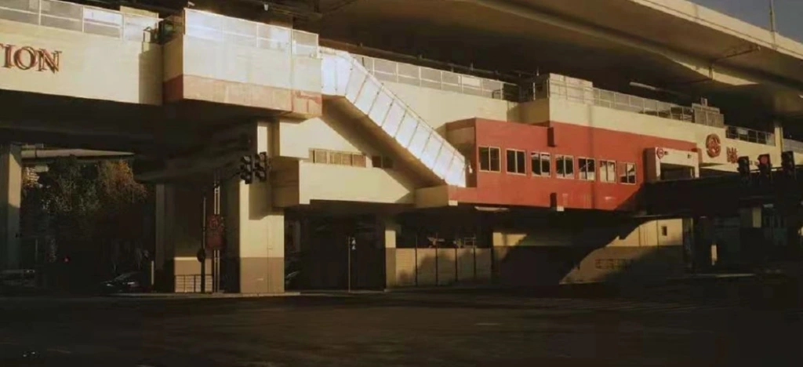

审判

那年我一直保留着一个奇怪的习惯，每次去学校接她送她回家，都会故意绕远走一条并不是那么平整的小路，一方面是想和她多说说话，另一方面是那条路是挺独特的：它的西边是一排商业建筑，却没有一家把店面朝着这条街开放，它的东边则是一堵棕灰色的高大看守所的围墙，围墙已很是老旧，墙面上还总有一些不知好歹的涂鸦。在我的记忆之中，几乎没有一个时刻，这条街是处在阳光之下的，它总是处在建筑物有意无意的、或是我自己为它杜撰的阴影之中。没有人的影子能洒在这条路上。而也是因为如此，它是一条不那么受欢迎的路，或者说，它根本不是一条我们喜欢的路，它是一条安静得有些让人感到紧张的路。

就是在这条路上，我常常和她，在傍晚时分漫步，或者我骑着我的自行车载着她，走过这条路。我们不谋而合地选择这条路，然后快快地通过它。在路上我们并不说话，或许是害怕的缘故，她会握紧我的手或者紧紧靠住我的背，我感到紧张又欣喜，不知道是墙顶的铁丝网还是墙上夸张到看起来几乎不是人类完成的高大的涂鸦，还是偶尔驶过的、发出巨大的卸货声响的重型货车，还是那些深夜里吹着口哨、在这条路上游手好闲、投掷石块的年轻的破坏分子，让我们在这条令人不安的路上，只剩下感受彼此接触的温暖，能使我们逃离出那贫乏的视觉和听觉向我们描绘出的世界，来到几乎快被遗忘的、感知的夹层中漫游。我不知道她是不是和我一样兴奋，我不知道此刻她是不是爱我。我心中巨大的疑问向我涌来，想到这里我不禁感到窒息，仿佛一个溺水者，忽然冷静下来，看到眼前的游动鱼群，竟产生了一丝快感。

但后来很长一段时间，我们都没有再走这条路，再后来，我因为参与了保密项目的缘故，很长一段时间没有和她见面。当我再次在那条路上看到她的时候，她似乎已是有了新欢，她与他，他们欢快的影子走在一起，像是告诉我一个不可能的答案。但我并非毫无准备，我早已在心中预想过这种可能性，我一点也没有慌张，而是约上了法官在另一个下午，这条路尽头的废弃体育馆的座位上与她见面。那天，我穿得整整齐齐，头顶戴着鸭舌帽，手上拿着法律资料，独自骑着自行车赴约。当她开口的第一句我就后悔了，她说：“我爱你啊。”

我从未想到我有如此狼狈的一刻，我那些精妙的，经受过漫长拷问的设想，在这一刻全都落空了，我开始感到羞愧、愤怒，想坚持说明她已经背叛了我。于是我说，“你不是，你在和他交往，对吧。”她紧张了起来，说，“根本没有啊。”我一时间竟语塞，也就是在那一刻，我开始明白，我确实能达到我设想的结局，但我已经错过我最想要的结局。话已出口，碍于面子我已别无选择。我坚持说，“你是，你是，我看见了，你是。”她低声低声啜泣着，仿佛从未料想的今天的一切，我也低下头，狠下心来一次次拒绝她的请求，我知道我已错过了她，就在我擅自决定告诉我的朋友们我们已绝无可能的那一刻，我就将得到这个结局。幸好，现在一切还在设想之内，而那些设想之外的，我并不期望我能得到。

于是在法官的宣判下，我们各自起身离开。现在已是秋天的傍晚，偶有几束光线从仓库的窗口穿出，落在看守所的高墙上，让整条路显得有些明亮。在走下体育馆的时刻，我才看清了那墙上的涂鸦，原来是用黑色粗体写着，“老酒日日醉，皇帝万万岁”。我默默擦去我的眼泪，骑上车，最后一次走上了这条路，秋天的风使我沉醉。我拐过两个路口，穿过一条明亮的积水隧道，回到我工作的工厂。我看见从未如此鲜艳的夕阳洒在工厂里那些巨大、锈迹斑斑的铁制管道上，时不时还有水滴落下，落在浅浅的金黄色的水塘里，让我几乎忘记这里曾经历过漫长的军人统治。

2022.2

Trail

I kept a strange habit that year. Every time I picked her up from school and sent her home, I would deliberately take a long detour down a not so smooth path, partly because I wanted to talk with her more and partly because that path was quite unique: its west side was a row of shops, but none of them opened their stores towards the street, and its east side was a tall brown and gray guardhouse wall, which was already very old. The wall is very old, and there is always some malicious graffiti on the wall. As far as I can remember, there was hardly a moment when the street was under the sun, it was always in the shadow of the building, either intentionally or not, or I made it up for myself. No one’s shadow can spill on this road. And because of this, it is a less popular road, or rather, it is not a road that we like at all, it is a quiet road and somewhat making us nervous.

On this, I often walked with her in the evening or drove her on my bicycle along this road. We coincidentally choose this road and pass it quickly. We don’t talk on the street, perhaps out of fear, and she holds my hand tightly or clings to my back. I feel nervous and elated, not knowing whether it’s the barbed wire at the top of the walls or the tall graffiti on the walls so exaggerated that it hardly looks humanly done, or the heavy trucks that occasionally drive by and make loud unloading noises, or the late-night whistling, wandering, rock-throwing young vandals, leaving us on this disturbing road with only the warmth of feeling each other’s contact, able to make our escape from the world portrayed to us by that poor vision and hearing, to roam in the almost forgotten, perceptual mezzanine. I don’t know if she is as excited as I am. I don’t know if she loves me. Huge doubts came to me, and I couldn’t help but feel suffocated at the thought, as if a drowning person suddenly calmed down, even had a moment of pleasure at the sight of the swimming fish in front of him.

But then, for a long time, we did not walk this road again, and then later, I did not meet with her for a long time because of my involvement in a secret project. When I saw her again on that road, she seemed to have a new love, she and he, their cheerful shadows walking together, as if to tell me an impossible answer. But I was not unprepared, I had long anticipated this possibility in my mind, and I did not panic at all. Still, I made an appointment to meet the judge on another afternoon in the seat of the abandoned gymnasium at the end of this road. That day, fully dressed, with a duck-top hat on my head and legal materials in hand, I rode my bike alone to the appointment. I regretted the first sentence when she opened her mouth and said, “I love you.”

I never thought I’d have such a tragic moment, all my subtle, long-tortured assumptions fell away in this moment, and I began to feel ashamed, angry and wanted to insist that she had betrayed me. So I said, “You’re not; you’re in love with him, are you?” She tensed up and said, “No, not at all.” I was speechless for a moment, and at that moment, I began to understand that I could indeed reach the ending I had envisioned, but I had missed the end I wanted most. The words were out, and I had no choice but to save face. I insisted, “You are, you are, I saw it, you are.” She whimpered and whimpered as if she had never expected this day. I bowed my head and ruthlessly refused her request repeatedly, knowing that I had missed her and that I would get this ending the moment I took the liberty of telling my friends that it was no longer possible for us. Fortunately, everything was still within the assumption, and what was beyond the premises, I didn’t expect to get.

So with the judge’s verdict, we each got up and left. It was now late in the fall evening, and a few occasional rays of light came through the warehouse windows and fell on the high walls of the guardhouse, making the whole path seem somewhat brighter. The moment I walked down the gymnasium, I saw the graffiti on that wall, which turned out to be bold black, “Get drunk with wine every day, long live the emperor.” I silently wiped away my tears, got on my bike, and walked up the road one last time, intoxicated by the autumn breeze. I turned two intersections, crossed a bright tunnel of standing water, and returned to the factory where I worked. I saw the sunset, which had never been so vivid, spilling over the factory’s vast, rusty iron pipes. Droplets of water fell in shallow, golden ponds, making me almost forget that this place had a long military rule.

Feb 2022
