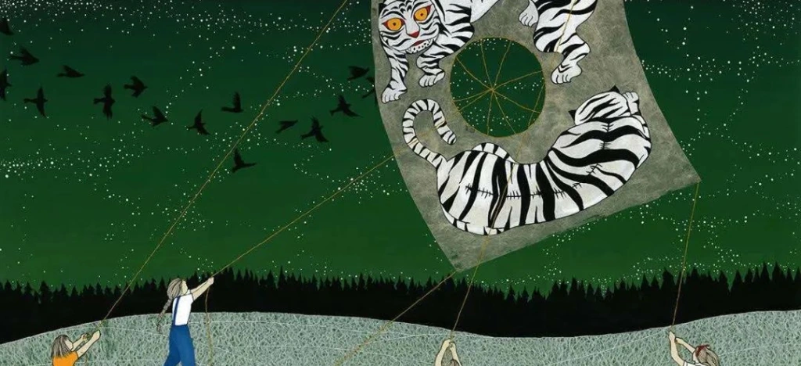

笔录

据说，人死亡前的最后一件事，是走出一座巨大平面的迷宫，无论你走多久都没有关系，死神有的是耐心。我在我很年轻时就步入了这座迷宫，我看到无数与我同行的人，像大学里的青年一般说笑，没有一点惊慌和恐惧。据说出口是随机出现的，但是他们为什么不恐惧呢。我想不清这些事，我周围的同伴，一个个都没有了消息，有些人只陪我走了几个折口，有些人陪得更长一些，但最后都消失了，不知道是去了别处，还是走出了迷宫。我开始习惯这种阴影中的生活，觉得自己太笨，活得太长。有一天，一个小个子的傀儡告诉我，原来这个迷宫是有地图的，我看见对面走来一个十来岁的万圣节打扮的女孩，我送给她糖，她送给我一个包裹，我十分高兴，还没拿出地图就看到了匕首。我感到了一种讽刺的意味，或许我就是一个令人尴尬的玩笑，我没有那么强的求生欲，我只是找不到出口的人，无法像别人一样正常地死去的人。

所以我就坐在这儿，抱着悲愤的心态写了一本书，叫做《信念的踵》，里面全都是关于这座迷宫的寓言。我写完它的那一刻，那些张牙舞爪的寓言像蝙蝠一般，从囚禁他们的书页里飞出来。他们像断线的风筝，像被戳破的特朗普气球，四散在阴天的天空中。我想这场精彩的黑火药烟花，是我死前送给世界最好的礼物，我激动夜不能寐，甚至不知道这意味着什么，那些警察就开始扬言将我逮捕。他们歇斯底里地想要抓回每一个我放跑的寓言。那些寓言就钻入无数的打印机开始自我复制，以至于天空中飘着无数寓言的副本，真假不分。这无疑是对警察工作的一种嘲讽，但接着，我看见那些寓言真真确确地发生了：孩子们惊慌地跑回家告诉父母狼的出现，乐观的投资者开始担忧天会不会塌下来，西洋商人开始同时出售锋利的矛和坚固的盾。但我并没有做错什么，我只是写了一些这个世界上没有的故事，我坚信我被通缉是悲哀的。如果这是我的结局，我只是想在死前，多同情一会儿那支形单影只的警察队，他们抓不完天空中的寓言，他们只能抓我，也许这是世界上最失败的职业。他们将我绑好并为我上刑，也许他们就不应该存在的，我想。

2020.6

Transcript

It is said that the last thing one does before death is to walk out of a vast maze, and it doesn’t matter how long you walk, death has patience. I stepped into this maze when I was very young, and I saw countless people walking with me, laughing and joking like college youths, without a trace of panic or fear. I was told that the exits appeared randomly, but why were they not afraid. I couldn’t think of these things, and my companions around me were not heard from one by one. Some only accompanied me for a few folds, some for a little longer, but in the end, they all disappeared, not knowing whether they went elsewhere or got out of the maze. I began to get used to this life in the shadows, feeling too stupid to live too long. One day a small golem told me that the maze turned out to have a map, and I saw a teenage girl dressed for Halloween walking across the street. And I gave her candy, and she gave me a package, and I was so happy that I saw the dagger before I could get out of the map. I felt a sense of irony that perhaps I was an embarrassing joke, that I didn’t have that strong a desire to live, that I was just someone who couldn’t find an exit, someone who couldn’t die as usually as anyone else.

So I just sat here and wrote a book with a sad mind called “Heel of Faith,” which is all about the parable of this maze. The moment I finished it, the fables with their teeth and claws flew out of the pages that imprisoned them like bats. They were like broken kites, like Donald Trump balloons that had been punctured, scattered in the overcast sky. I thought this excellent black powder firework was the best gift I could give the world before I died, and I was so excited I couldn’t sleep at night, not knowing what it meant, when the cops started threatening to have me arrested. They were hysterical, trying to catch every fable I had let go of. The fables then burrowed into countless printers and began to reproduce themselves so that numerous copies of the fables were floating in the sky, indistinguishable from the real ones. It was a mockery of police work, but then I saw the fables happening: children running home in a panic to tell their parents about the wolf, optimistic investors worrying about the sky falling, and western business people selling both sharp spears strong shields. But I did nothing wrong, I just wrote stories that are not in this world, and I am convinced that it is sad that I am wanted. If this is the end of me, I just want to have a little more sympathy before I die for the shapeless police force who can’t finish catching the fables in the sky. They can only arrest me, perhaps the world’s most failed profession. They tied me up and tortured me, and maybe they shouldn’t have existed, I thought.

June 2020
