2025年1月和我的朋友三三一起去了蓄谋已久的缅甸，在仰光，蒲甘，曼德勒。和新闻里的印象不同，缅甸给我留下的印象极好，缅甸人热情友善，蒲甘的佛塔极其壮观美丽。现在回想起来，当时确实赶上了一个极好的机会，旅行结束之后不久就是实皆大地震，摧毁了曼德勒，蒲甘的治安也开始恶化，只有仰光还如旧。不知下次会是什么时候再去，我对这片土地上的人民抱有极其深刻的同情，过去四年他们经历了太多的不幸。以下是那段时间在日记，朋友圈的记录，朋友说想让我做个存档，我想放这里就好。

### 回忆缅甸_1
​
​一时不知从何说起，提起仰光我都是温暖的回忆，大概就是车开在宽敞的卑缪路上，缅甸国旗在路灯旗杆上飘。我不知道为什么仰光有这么大的风，那些旗帜都能舒展开来。车大多都是十八手丰田，内饰已经衰败，但是后视镜上总会挂着新鲜的花串。我想，那些新鲜的花串一定是被虔诚地摆放的。虽然司机背对着我，我看不到他的脸，也不知道他的想法。我曾看见一位司机在路途中向街边的小贩买过，一条要三五千缅币，并不便宜。一个受苦的人还要努力装饰自己的生活，除了信仰我想不到别的理由。

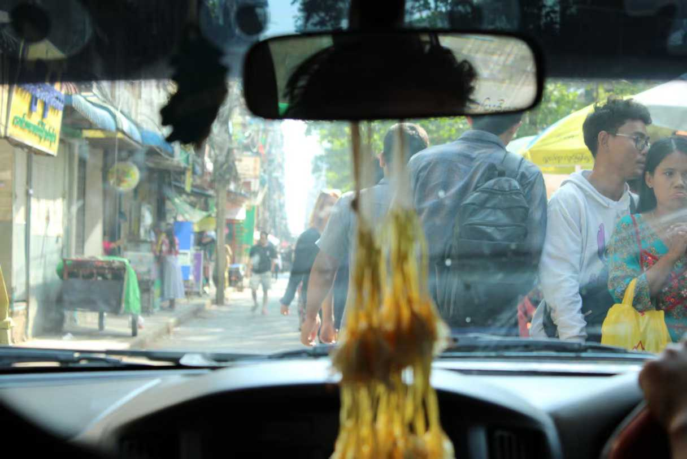

### 回忆缅甸_2

在汽车客运站，我和三三准备吃完晚饭就去蒲甘。那个汽车客运站十分狂野，客车车身上涂着夸张的缅语字母，每从土路上驶过就尘土飞扬。行人，自行车和狗在车流的间隙中穿梭。我们走进一家看起来还可以的路边餐馆，那餐馆的桌椅摆得离路很近，几个缅甸人在旁边的桌抽烟聊天。服务员看到我们坐下，瞪大眼睛显得很兴奋，他向我们递来一份只有缅语的菜单——那菜单上的菜品十分丰富，正反两面加一块，我怀疑都有 200 种菜品。可是我们一句都看不懂，用谷歌翻译也看不懂。看我们有些许困难，他给我们指了指其中的几行做推荐，我看了看他，那是一种卑微到极点的眼神，仿佛我们读不懂缅语是他的问题。我们坐着聊天，他就坐在我们旁边陪着。吃完天就黑了，没有电。他站起来为我们结账，穿着笼基让他的身体显得更加细瘦。他的礼貌让我感到惭愧。

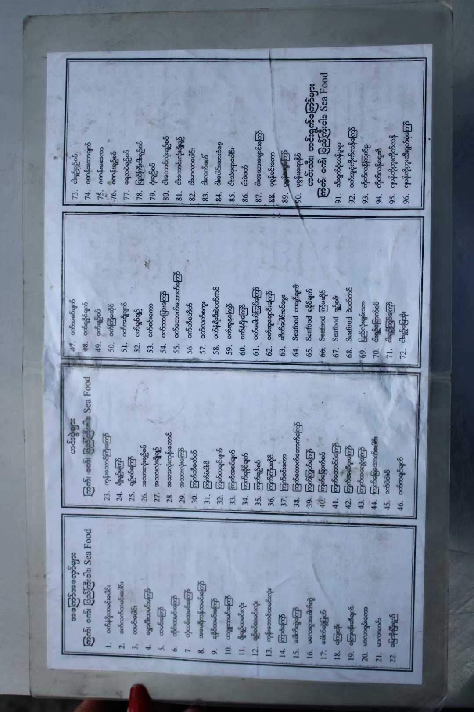

### 回忆缅甸_3

在蒲甘南明瞭望塔，我和三三偶遇了一群私立高中的高中生，大概有两百人。依据穿着他们看起来来自于富裕家庭。于是我们发生了以下对话，我只参与了前半段，后半段由三三复述。

我：你们来自哪里？  
学生：马圭省的一个小镇  
我：你们今天组团来蒲甘，是毕业典礼吗？  
学生：不是，只是集体旅行，这样的旅行在缅甸并不多见  
三三：缅甸战乱，四处都很危险，你会考虑离开这里吗？  
学生：不，我爱我的国家，蒲甘的景色多么美丽，我不会离开这里。  
三三：那如果政府征兵，要求你加入军队呢？  
学生：噢不，那我要离开这里  

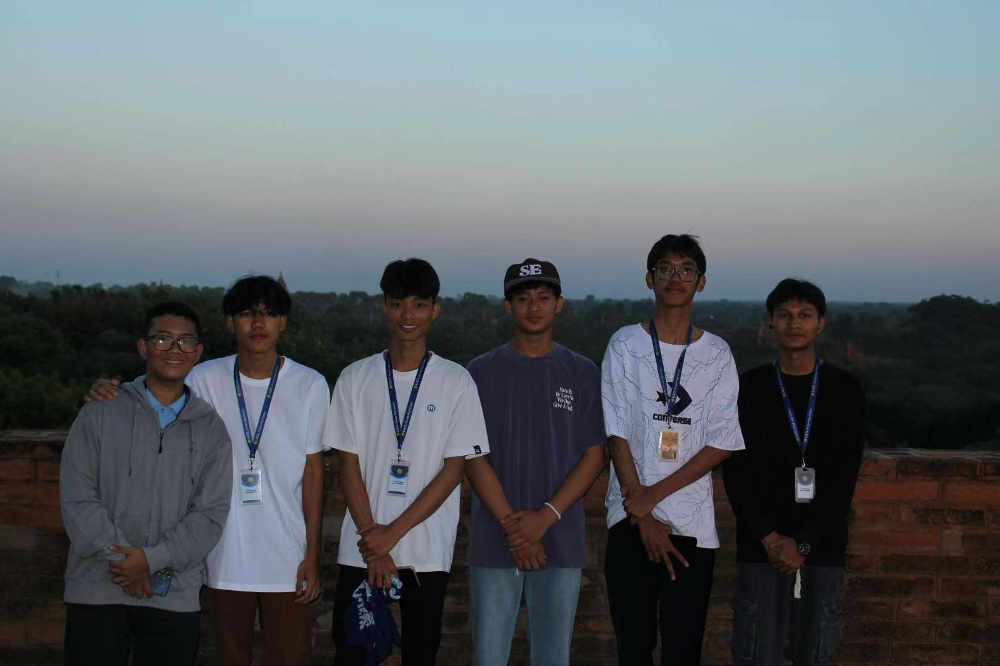

### 回忆缅甸_4

清晨到蒲甘，天还是黑的。司机接我们去一个小土堆上等日出，时间太早，周围漆黑一片，安静地听不到一点响声。在车厢里我们和司机发生了以下对话，在黑暗中我看不到他的脸，只能听见他沉稳的声音。他的英语好的出奇，甚至比我在仰光遇到的缅甸人都说得更好。  

我：蒲甘安全吗？  
司机：这里很安全，但是河对面不安全，有叛军在和政府军交战。  
我：这里像我们这样的游客多吗？  
司机：这两年很少了  
.......  
我意识到了一些事，沉默了一会儿，忽然问他  
我：师傅，你有孩子吗？你会担心你的孩子被征兵吗？  
司机：我有一个儿子，一个女儿，儿子十六岁，但是还好现在不用去军队，离征兵年龄还有两年。哈哈，这个问题我也不知道怎么办了，我希望战争很快就会结束。你们是什么看法？  
我：我只是根据新闻上的消息做判断，我觉得这场战争很难在两年内结束，因为两边都有资金支援，两边都想占领腊戌。  
司机：是的，腊戌是一个问题。你们知道 pdf (People's Defense Force) 吗？许多人加入了 pdf。  
我：我知道。  
说到这儿我们都沉默了，等早晨日出拍完照片，回来找他时，我才看清了他的脸：那时他在车旁等我们，他有些秃顶，脸上皱纹沿着笑容弯曲，嘴里的牙因为嚼槟榔而有些血红色，即使不告诉我，我也能用直觉判断出，那是一位父亲的脸。  

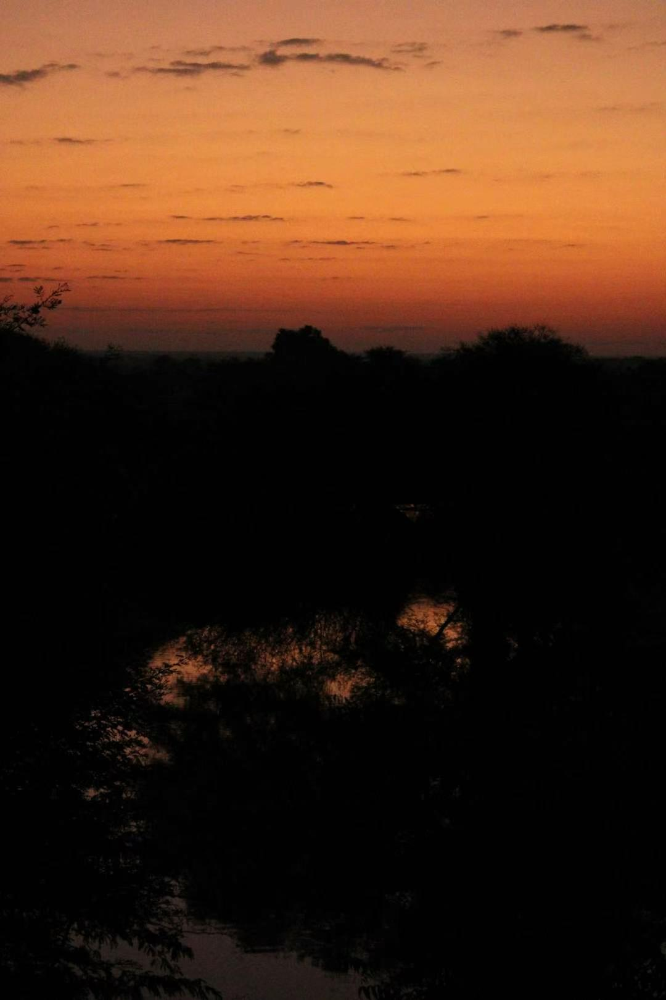

## 回忆缅甸_5

虽说是战争国家，在战争的大后方，大多数人的生活还是与和平时期无异。譬如在集市，左手边是卖衣帽服饰的店铺，右手边是卖食物的小贩，拥挤而热闹。晚上九点路边还有表演的乐队，大伙高兴地围着看，孩子在马路上踢球。甚至，路上都看不到几个警察，只有在几个关键的路口和检查站才能看到他们。三三说，路是很重要的战略目标，是要重点看护的。防卫一个城市，把军队都分散布置在城内的街道上是不经济的，看住几个关卡，制高点就足矣。所以，你说战争国家能有什么战争氛围？大概只有贫穷通胀和停电。缅币这两年已经至少贬值了一倍，本地油价涨了四倍，餐厅菜单上要么把价格涂掉，要么就根本不标价格。停电，晚上的城市漆黑一片，白天路边的发电机震天响。曼德勒的加油站大排长龙，大概如此。还有就是强制征兵，但这需要细致的观察才会发现，青壮年男性很少，只有中老年人，女人和孩子。但除此之外，真没有别的特别之处。我遇到的缅甸人看起来都是快乐的，比如我和三三在仰光大学外买水时遇到的摊贩，一个父亲带着他的两个女儿，我们问可乐要多少钱，他们就在到底如何翻译 1500 这个数字的问题上玩闹般地争论了起来，我看他们如此欢乐，于是问他们能不能拍个照片，他们同意了。我其实想问他，你有没有儿子在军队，他什么时候会回来？但是在那一刻，我不想问这种扫兴的问题。我有时候有些遗憾没有问他们要联系方式而这一刻就永远保存在他们无法触及到的别处。

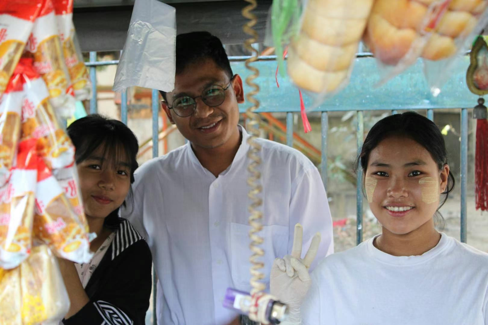

### 回忆缅甸_6

但是你还是能看到青壮年男性的，在仰光，有两种情况，先说第一种，那就是大学生，毕竟让大学生去当兵也过于昂贵了。我和三三误入了仰光大学，大学里的男女比例要正常许多，只要跨入了大门，这里的大学生活就全世界别处的大学没什么不同，长长的林荫路，明亮的教学楼，学院被规整的围墙围起来，还有教授一般的人，三两成群的学生和情侣。我们上到地理系的教学楼的时候被拦住了，他们一时摸不清我们是在做什么的，于是叫出了系主任。系主任高高瘦瘦，一看就是标准的缅族女性的打扮，她对我们盘问了一番，知道了我们是中国游客，她尴尬地欢迎了我们，说我们行进的方向是一条死路，并建议我们去看看学校的大会堂。我表示我们已经看过了。没过多久，就有两个校警找到我们，说着流利的英语，告诉我们这里不让参观，要我们马上离开，然后跟了我们一路送我们出门。三三说，他们都太紧张了。我可以理解，他们生怕大学里出了什么事，军政府和大学的关系不好。我印象最深的大概是一对情侣，看他们刚成年的样子，他们看到我胸口的相机不好意思做什么，等我离开之后才亲热了起来。这便是战争国家里的爱情。

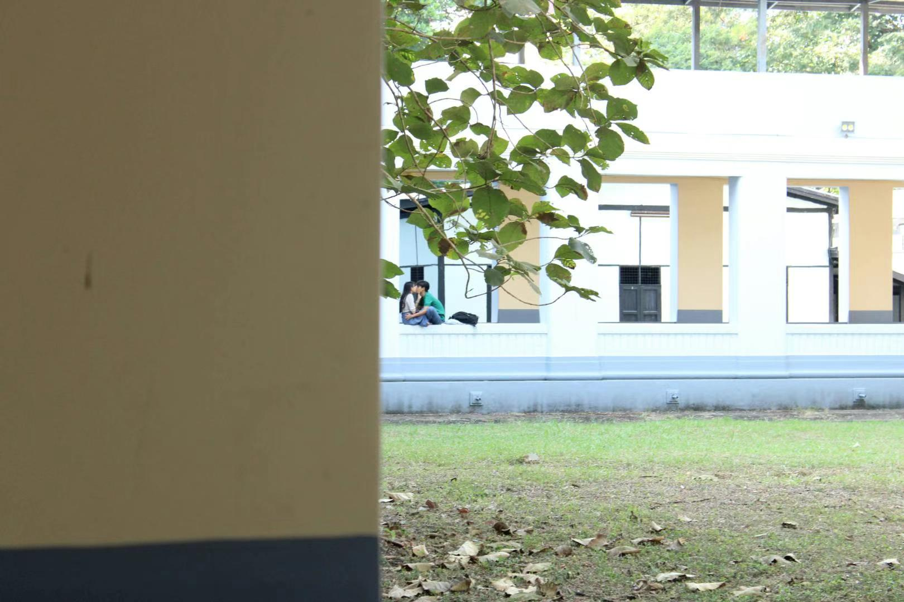

### 回忆缅甸_7

军队打完一场仗，是要轮换的。士兵需要回到大后方休息，不然军队的战斗力会越来越差，这是三三告诉我的。所以我在想，我在这里遇到的人，他们有多少是在短暂地离开前线回家度假，有多少是在等待被征兵的命运？在仰光环城火车上我遇到的都是穷人，他们是住在仰光市郊，白天依靠火车进城，挑着扁担或者顶着竹篮，他们卖一些食物，槟榔或者檀娜卡，还有一些编制的竹席，竹毯之类的东西。几乎看不到年轻人，都是中年男女，几乎无法用英语交流。在其中我只看到了一对年轻情侣，他们在车厢里是格格不入的存在，他们不像其他人，手中什么都没有，只是安静地坐着，牵着手。他们对着我胸前的相机看了好几次。我起初问男孩子能不能给他们照片，他拒绝了，然而过了一会儿，我看到他露出后悔的表情，于是又问了一次，他欢快地同意了。我不知道他们能在一块多久，但总是感觉他很忧愁，我不知道是因为征兵，还是因为这是士兵的一段短暂假期。但是看女孩子的表情，总是阳光而坚定。这也是战争国家里的爱情。

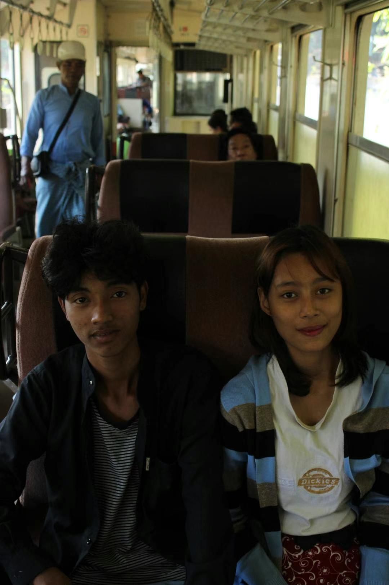

### 回忆缅甸_8

从财税角度，不难看到缅甸国防军的强势，军费常年占 gdp 比例在 5% 左右。作为第三世界国家，腐败难以避免，本身政府的财税效率并不高，还拥有大量的国有企业。财政收入大概占 GDP 20% 左右，拨给公共服务和投资的经费十分有限，战事一旦吃紧，就更捉襟见肘了，且会引发外资撤离。这一点与旅行中的种种观察一致，仰光市中心在修的高楼（Yoma Central 和仰光香格里拉酒店）都处于停工烂尾状态。仰光稍微小众一些的旅游景点，大多也因为缺少游客关闭，比如缅甸国家博物馆，仰光烈士陵园。蒲甘的通票就直接没人收了，佛塔看护的资金现在要依赖考古队。此外，我对缅甸政府的税收效率非常怀疑，仰光肯德基和曼德勒餐厅的收据上会贴上消费税缴税的贴纸，而其他餐馆，商铺消费均没有。三三说，让人意外缅军没有像肯尼亚军队一样在交通要道上层层设卡要过路费，说明缅军军纪不错，这内战还能继续打下去。

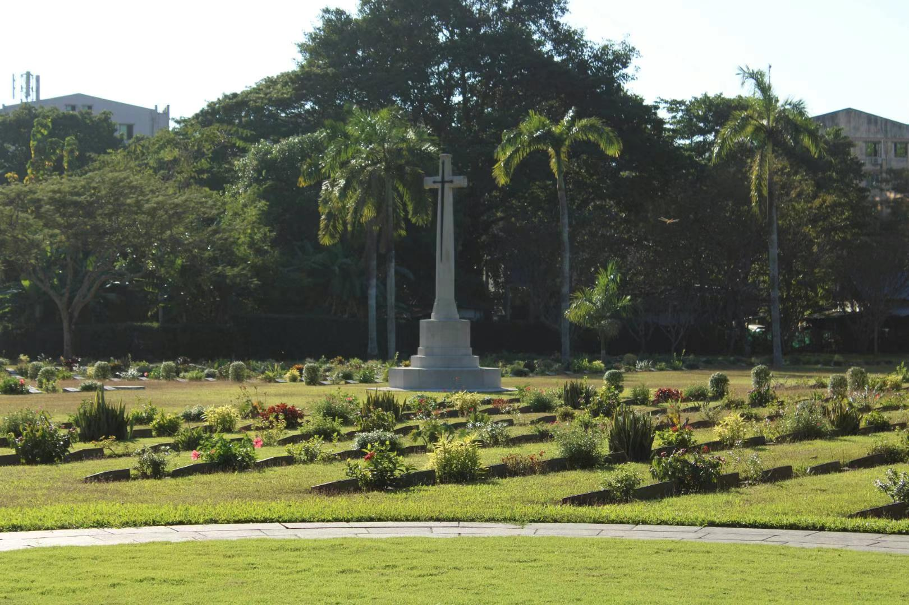

### 回忆缅甸_9

在蒲甘某座佛寺，已经不太记得名字，是一个中年女人在看护。她领我们进去转了一圈，然后说，你看别的寺都热热闹闹的，就这里冷冷清清。  

说罢了就给我们指，寺庙旁边，在讲佛陀的故事，这是佛陀出生在牛棚，这是佛陀出家，这是佛陀在菩提树下冥想，这是佛陀涅槃。  

说完了，说，我给你们涂一点檀娜卡（Thanaka）好不好？不用钱。  

我们说好，于是她就拿出一小块肥皂一般的檀娜卡，用水湿润，涂抹在她手上，然后再抹在我们脸上，那味道有一股檀香味。  

所以那天我们比之前都更像缅甸人了一些，我很早很早就想过这样的心情，就是成为缅甸人的心情。那大概是“不妨对你我的痛苦多了解一分”。  

### 回忆缅甸_10
​
​在昂山市场买了笼基，对话非常简单  

我：这里卖笼基吗？

一个胖胖的中年人站了起来，看上去是很久都没有来客人了，说，卖啊，然后指给我看，这条是 6000 缅币，其他的都要 10000 缅币。

我说，好啊，但是笼基都封在塑料包装里，我能拆开体验一下吗？

他说，不能，买到是什么样就是什么样。

我说，我就要那条 6000 缅币的，能告诉我一下怎么穿吗？

他解开了自己的笼基，原来是一块围成圆筒状的布，解开之后比自己的腰身大很多，然后他说，你看，只要这样，这样，再这样，就系好了。

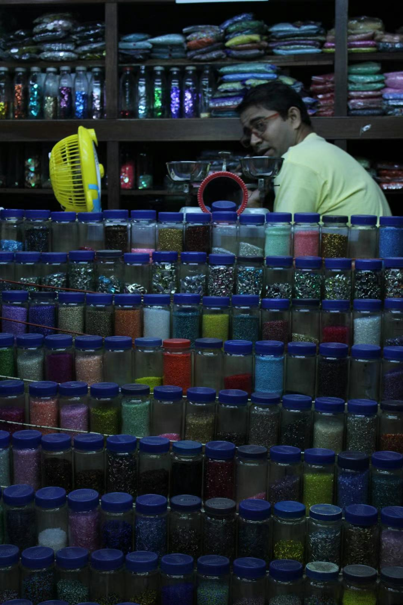

### 回忆缅甸_11

在蒲甘和曼德勒，外国游客相比仰光要多一些，仔细数，还是能看到一些欧洲面孔，大家都怀着不同的目的，不同的心态在体验这个地方。

在蒲甘早上去曼德勒的时候，坐三轮车去车站，通行的是一对澳大利亚中年夫妇，到曼德勒去酒店之后的路又同行了一段。三三说，典型的中年老白男画像，一路上骂骂咧咧。他的妻子倒也还好，友好地问了问行程和安全情况。

在曼德勒山遇到了一个独自旅行的中国人，无趣地寒暄，后来在第二天又遇到了，三三说他特别符合国内中年人画像，就是一个劲地说个不停，也不管别人爱不爱听，一种“总算逮到你了，我一定要找你说说”的感觉。

在实皆省遇到了一个穿着打扮都很漂亮的中国女生，自己请了个导游，看起来也是独自旅行，有个当地人给她讲解，我们打个招呼就再无后续。

还是在曼德勒山顶，遇到了一个以色列姐姐和奥地利大哥，第二天我们就约好一起玩，后来还加了联系方式。
我们晚餐的时候聊了聊自己旅行的收获。以色列的姐姐说，她旅行有一些逃离自己的国家，给自己的生活暂停一下的意味，同时也能够观察别的战争国家的状态。她画画很好，虽然她一个人来缅甸，但是并没有感到很害怕，之后和她的丈夫一块继续游东南亚，还有中国。

奥地利大哥是在泰国有房产，在德国开公司，每年都来泰国住一阵，就突发奇想来隔壁的缅甸转转，他直言还没准备好如何体验这个地方，最轻松的大概还是找个地方放松一下。不过入境之后已经有很多麻烦，比如信用卡信息制裁没法使用。

我说，我的脑海中有太多对于缅甸的想象，这次旅行就是为了抵达我的想象。它让我变得更加勇敢，更加有力量。

三三说，I really feel bad about the people here. 仔细观察，人民饱受战争之苦。而他们都如此友善，谦卑，让人同情，他们不应该拥有这样的生活。

这便旅行的结尾。游客便是这样，我们各自怀着各自不同的心情和目的来到这个地方，然后带着各自的答案回去。所以，我想把这些回忆记下，这大概就是 2025 年初的缅甸，记录历史是一贯的爱好，理解他人的苦难是永恒的追求。

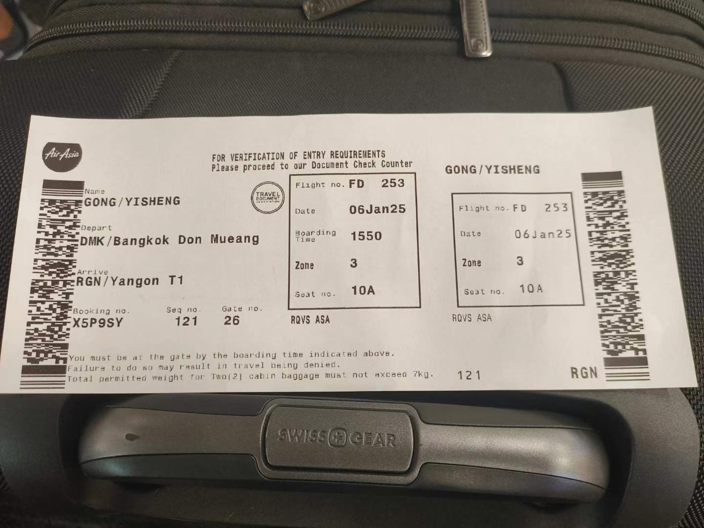

### 缅甸瞬间_1

仰光夜晚，​我问一个做槟榔的小贩，能不能给他拍一张照片，他说，我是掸族，拍槟榔可以，但是不要拍我人。  
​我拍完重复了一遍他的话，我是掸族，拍槟榔可以，但是不要拍我人。

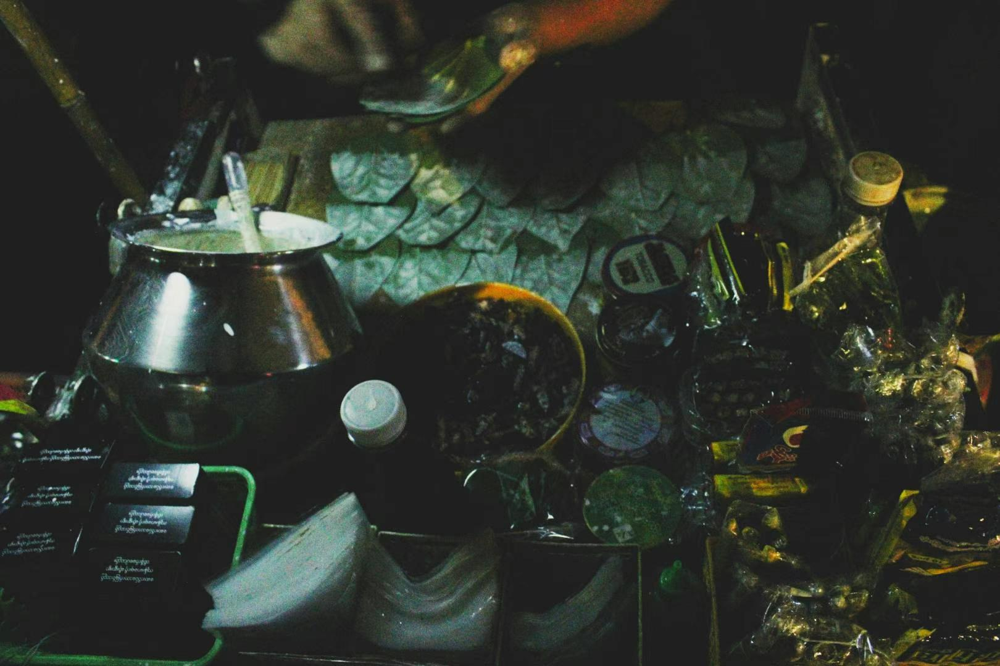

### 缅甸瞬间_2

​无尽的香蕉树肆意生长在铁道边

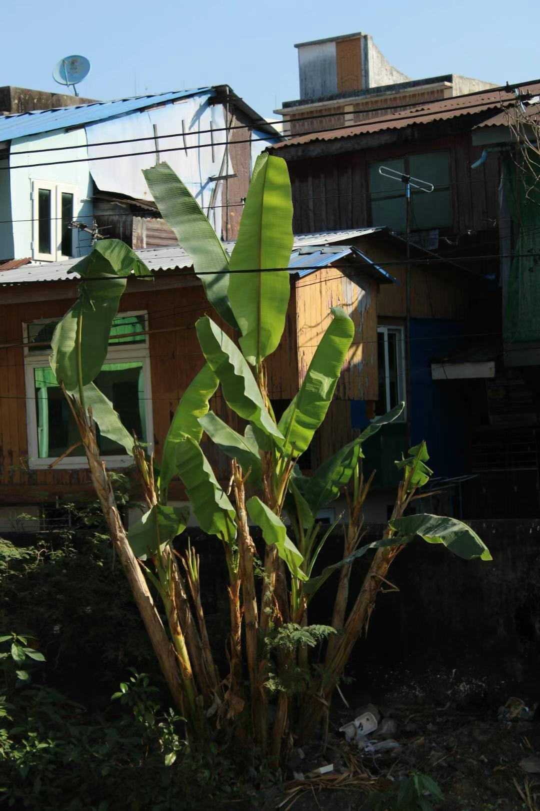

### 缅甸瞬间_3

身体已经回国了，脑海中我还在实皆省。  

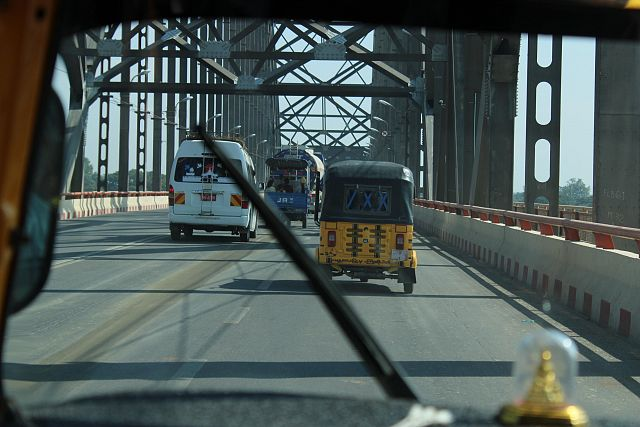

### 番外日记_1

昨天落地仰光，和出租车司机闲聊，他非常友好。和我们说缅甸人晚上都不敢出门，会被军人查身份证，但是中国人可以。缅甸人都怕中国人（原话，可能是其他意思），因为中国人背后有强大的政府。

在从机场去老城区的路上，道路中央立着许许多多的国旗，他给我们指，这是茵雅湖，这是大金塔，那边是中国城。

他和我们说缅甸现在一天 4 小时停电，来电一次。没有电，就只能用自己的发电机。油价从 1000 多缅币涨到了 4000 缅币，economy is so bad. 游客也少了许多。他给我们推荐了mohinga 这种食物，还有掸面。

快到目的地，和我说，我能不能用泰铢付钱？我明知道他是企图多要一点（泰铢缅币汇率只有 100，正常应该到 150 这样），但想想算了，不纠缠这些事。

然后就是办电话卡，和英语说的磕磕碰碰但是还是企图和我说明白的小姑娘聊了许久，总算在另一个服务员的帮助下完成。再去换钱，先去中国城超市，那边美元缅币汇率只有 4000 多，不划算。缅甸人都黑黑瘦瘦的，中国城很热闹，许多小贩自带电灯做路边摊生意，还有路上唱歌的乐队。再去外婆家饭店吃饭，换缅币。老板说，这个美元有折痕，不好收，现在只收人民币泰铢。最后我们各自换了几十万缅币解决问题。

吃完饭回家，三三开始给我科普，这个纸币做了记号，是地下钱庄的标志，美元不是不想收，有折痕污渍是企图谈个低价的方式。

回到酒店内，我去楼上拍照片，这个城市黑漆漆的一片，只有大金塔在远方金光闪闪，是城市的唯一坐标。大概如此。  

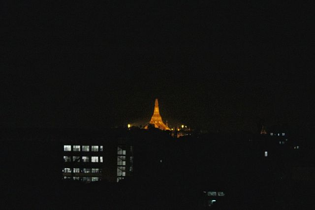

### 番外日记_2

说是去缅甸体验战争国家的人民生活，但实际上完全没有战争氛围（最多最多就是检查站，路障，和拿着锈枪的军警），看到也不会让人害怕，无论是仰光，蒲甘还是曼德勒。大家生活该怎么过还是怎么过。这还是烈度并不算低的缅甸内战。引用三三：在战争国家你能体验的只有贫穷，通胀和停电（我加一个物资短缺）。战争下的生活是可以接受的，这才是战争最可怕的地方。  

### Q&A

最后回复一下大家关心的问题  

​Q: 东南亚安全吗？  
​A: 取决于你是否社牛到同周围的中国人说话，只要尽量远离中国人，就是安全的  
​
​Q: 缅甸安全吗？  
​A: 如果从仰光曼德勒入境，安全，甚至比泰国还安全，因为缅甸需要签证，且难以穿越战线进入诈骗园区所在的地方武装控制范围。晚上也安全，和本地人同一时间回家即可。以上经验仅限于仰光蒲甘曼德勒，远离战区，远离政府无法控制的地区，安全情况提前问清楚当地人。  
​
​Q: 所以诈骗园区是怎么一回事  
​A: 一群中国人在泰缅边境的法外之地骗中国人，和泰国缅甸毫无关系，大概如此。去园区的人大多出于贫困，且自己知道自己是去干什么的。拐骗不是主流。  

